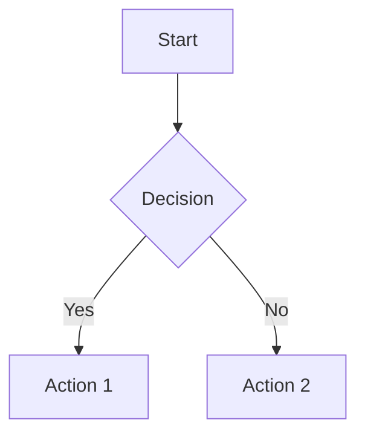

# Graph Technology Developers GitHub Pages Template (for Educational Resources)

A minimal, responsive template for publishing open-source educational resources on GitHub Pages. Optimized for developer readability, SEO, and AI-agent parsing.

[](https://pages.github.com/)
[](https://jekyllrb.com/)
[](https://github.com/features/actions)
[](LICENSE)

## Features

- **Mobile-responsive design** - Works beautifully on all devices
- **SEO optimized** - Built-in meta tags, sitemap, and semantic HTML
- **AI-friendly structure** - Optimized for readability by AI agents
- **Code syntax highlighting** - Support for multiple programming languages
- **Diagram support** - Mermaid.js integration for technical visualizations
- **Dark mode** - Automatic dark mode via `prefers-color-scheme`
- **Minimal custom theme** - Clean, distinct styling without heavy dependencies
- **Auto-deployment** - GitHub Actions workflow for automatic deployment

## Quick Start

1. **Clone or fork this repository**

   ```bash
   git clone https://github.com/GraphTechnologyDevelopers/gh-pages-template.git
   cd gh-pages-template
   ```

2. **Update configuration**

   Edit `_config.yml` and update:
   - `title` - Your site title
   - `description` - Site description
   - `url` - `https://{username}.github.io` (or your custom domain)
   - `baseurl` - `/{repository-name}` for project sites, or `""` for user/org sites

3. **Customize footer links** (optional)

   Edit `_includes/footer.html` to update or add footer links.

4. **Add your content**

   - Edit `index.md` for the homepage
   - Add new `.md` files for additional pages
   - Place images and assets in `assets/` directory

5. **Deploy**

   - Push to GitHub
   - Enable GitHub Pages in repository Settings → Pages (select "GitHub Actions")
   - Your site will be live at `https://{username}.github.io/{repository-name}`

## Project Structure

```
.
├── _config.yml          # Jekyll configuration
├── _layouts/            # HTML layouts
│   ├── default.html     # Default page layout
│   └── page.html        # Content page layout
├── _includes/           # Reusable components
│   ├── head.html        # Head section with meta tags
│   └── footer.html      # Footer with links
├── assets/              # Static assets
│   ├── css/
│   │   └── styles.css   # Custom styles
│   ├── js/
│   │   └── main.js      # JavaScript functionality
│   └── images/          # Image files
├── pages/                # Additional pages
│   └── getting-started.md
├── index.md              # Homepage
├── robots.txt            # SEO robots file
├── .github/
│   └── workflows/
│       └── pages.yml     # GitHub Actions deployment
└── README.md             # This file
```

## Adding Content

### Creating New Pages

Create new `.md` files anywhere in the repository. They'll automatically use the page layout:

```markdown
---
title: My New Page
---

# My New Page

Your content here...
```

### Code Blocks

Use triple backticks with language identifiers:

````markdown
```python
def hello():
    print("Hello, World!")
```
````

### Diagrams

Use Mermaid syntax for diagrams:

````markdown

````

### Images

Place images in `assets/images/` and reference them:

```markdown

```

## Customization

### Styling

Edit `assets/css/styles.css` to customize the theme. The CSS uses variables for easy customization:

```css
:root {
  --color-bg: #ffffff;
  --color-text: #1a1a1a;
  --color-link: #0066cc;
  /* ... */
}
```

### Layouts

Modify `_layouts/default.html` or `_layouts/page.html` to change page structure.

### Configuration

See `_config.yml` for all available configuration options. Key settings:

- `title` - Site title
- `description` - Site description for SEO
- `url` / `baseurl` - GitHub Pages URL configuration
- `plugins` - Jekyll plugins (SEO, sitemap)

## SEO Optimization

This template includes:

- **jekyll-seo-tag** - Automatic meta tags, Open Graph, Twitter Cards
- **jekyll-sitemap** - Automatic sitemap generation
- Semantic HTML structure
- Clean heading hierarchy
- Mobile-friendly responsive design

Add page-specific SEO in front matter:

```yaml
---
title: Page Title
description: Page description for search engines
keywords: keyword1, keyword2
---
```

## Deployment

The GitHub Actions workflow (`/.github/workflows/pages.yml`) automatically:

1. Builds the Jekyll site on push to `main`
2. Deploys to GitHub Pages
3. Handles dependencies and caching

**No manual deployment steps needed!**

To enable:
1. Go to repository Settings → Pages
2. Select "GitHub Actions" as the source
3. Push to `main` branch

## Local Development

To test locally (requires Ruby 3.0+ and Jekyll):

### Prerequisites

Install Ruby 3.0 or newer. Recommended methods:

**Using Homebrew (macOS):**
```bash
brew install ruby
```

**Using rbenv (recommended):**
```bash
# Install rbenv
brew install rbenv ruby-build

# Install Ruby 3.0+
rbenv install 3.3.0
rbenv local 3.3.0
```

**Using asdf:**
```bash
# Install asdf plugin
asdf plugin add ruby

# Install Ruby 3.0+
asdf install ruby 3.3.0
asdf local ruby 3.3.0
```

### Setup and Run

```bash
# Install dependencies (local to project, no sudo needed)
bundle install --path vendor/bundle

# Serve locally (without baseurl prefix for easier testing)
bundle exec jekyll serve --baseurl ""

# Or test with baseurl to match production:
bundle exec jekyll serve

# Visit http://localhost:4000
# (or http://localhost:4000/gh-pages-template if baseurl is set)
```

**Note:** 
- The `--baseurl ""` flag allows you to test without the baseurl prefix locally
- Use `bundle install --path vendor/bundle` to install gems locally without sudo
- For production, GitHub Pages will handle the baseurl automatically based on your repository settings

## Browser Support

- Chrome (latest)
- Firefox (latest)
- Safari (latest)
- Edge (latest)

## Technologies Used

- [Jekyll](https://jekyllrb.com/) - Static site generator
- [GitHub Pages](https://pages.github.com/) - Hosting
- [GitHub Actions](https://github.com/features/actions) - CI/CD
- [Mermaid.js](https://mermaid.js.org/) - Diagram rendering
- [jekyll-seo-tag](https://github.com/jekyll/jekyll-seo-tag) - SEO optimization
- [jekyll-sitemap](https://github.com/jekyll/jekyll-sitemap) - Sitemap generation

## License

This template is available as open source under the MIT License.

## Contributing

Contributions are welcome! Please feel free to submit a Pull Request.

## Links

- [Graph Technology Developers GitHub Org](https://github.com/GraphTechnologyDevelopers)
- [Graph Technology Developers Community Hub](https://graphtech.dev/)
- [Graph Technology Developers X Community](https://x.com/i/communities/1977449294861881612)
- [CodeGraphTheory on GitHub](https://github.com/codegraphtheory)
- [CodeGraph on X](http://x.com/codegraph)
- [GraphTheory on X](http://x.com/graphtheory)

## Support

For issues or questions:

- Open an issue in this repository
- Visit [Graph Technology Developers](https://graphtech.dev/)
- Join the [X community](https://x.com/i/communities/1977449294861881612)

