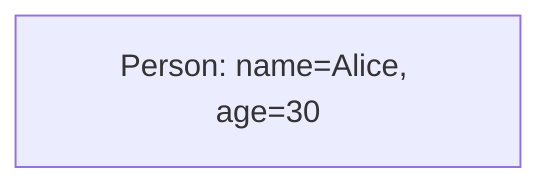
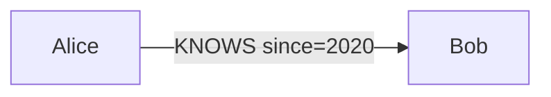
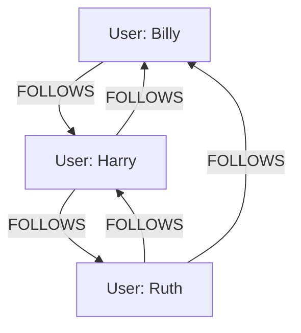

At heart, graph DBs store nodes and relationships.

- **Nodes**: Represent entities (users, products). Each has:
  - Unique ID (auto-generated or custom).
  - Labels (categories, e.g., :Person, :Movie—multi-label possible).
  - Properties (key-values: name="Alice", rating=4.5).

- **Edges**: Connect nodes.
  - Direction: -> for outgoing, <- for incoming.
  - Labels: :KNOWS, :BOUGHT (defines type).
  - Properties: since=2020, strength=0.8.
  - Uniqueness: Often enforced to avoid duplicates.

### Explaining Nodes in Depth

Nodes are the building blocks, representing any entity. IDs ensure uniqueness; labels group them (e.g., query all :Person). Properties store data like attributes.

Why flexible: No schema means add properties anytime, ideal for evolving apps.

Code Sample (Cypher create node):
```cypher
CREATE (p:Person {name: 'Alice', age: 30})
RETURN p
```



### Explaining Edges in Depth

Edges define how nodes relate, with direction for semantics (e.g., :FOLLOWS is directed). Labels type them; properties add details like timestamps.

Why powerful: Edges are first-class citizens, enabling fast traversals without joins.

Code Sample:
```cypher
MATCH (a:Person {name: 'Alice'}), (b:Person {name: 'Bob'})
CREATE (a)-["r:KNOWS {since: 2020}"]->(b)
RETURN r
```



No fixed schema—add properties on the fly. But for efficiency, index frequent ones (e.g., CREATE INDEX ON :Person(name)).

How: In property graphs (dominant model), everything's key-value enriched. Traversal: Start at node, follow edges via pointers.

Example: Twitter graph.



Why: Mimics real-world—flexible, efficient for connected queries.
