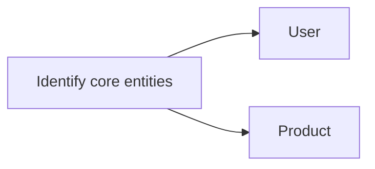
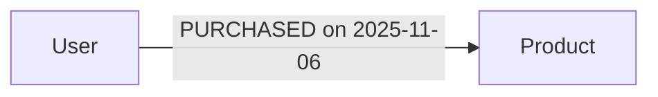
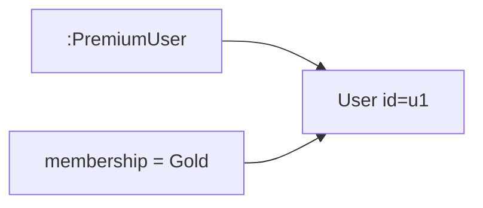
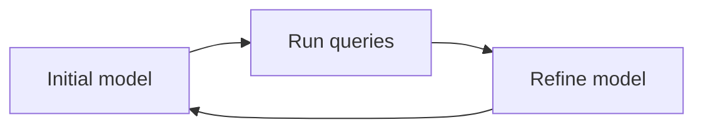
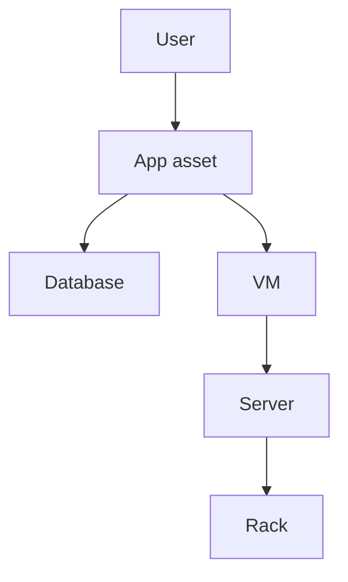

Model whiteboard-style: Sketch entities, draw arrows.

Steps:
1. Identify nodes: Core entities.
2. Define relationships: How they connect?
3. Add labels/properties: Enrich.
4. Iterate: Test with sample queries.

### Explaining Identify Nodes in Depth

Start with domain nouns as nodes (e.g., User, Product in e-commerce).

Why first: Nodes are foundations; misidentify, and model skews.

Code Sample:
```cypher
CREATE (u:User {id: 'u1'}), (p:Product {id: 'p1'})
```



### Explaining Define Relationships in Depth

Verbs become edges (e.g., :PURCHASED).

Why crucial: Relationships drive value; wrong types hinder queries.

Code Sample:
```cypher
MATCH (u:User {id: 'u1'}), (p:Product {id: 'p1'})
CREATE (u)-[":PURCHASED {date: '2025-11-06'}"]->(p)
```



### Explaining Add Labels/Properties in Depth

Labels categorize; properties add data.

Why enrich: Enables filtered queries, richer analysis.

Code Sample:
```cypher
MATCH (u:User {id: 'u1'})
SET u:PremiumUser, u.membership = 'Gold'
```



### Explaining Iterate in Depth

Run queries, refine model based on perf/needs.

Why agile: Models evolve with business.

Code Sample (Test query):
```cypher
MATCH (u:User)-[":PURCHASED"]->(p:Product)
RETURN count(p) AS purchases
```



Example: Movie domain.
- Nodes: :Actor {name}, :Movie {title, year}.
- Edges: (actor)-[":ACTED_IN {role}"]->(movie).

Avoid relational pitfalls: No join tables—use edges. Model events as nodes if they have properties (e.g., :Purchase node with date, amount).

For time-series: Use chains like (event1)-[":NEXT"]->(event2).

Validate: Run queries early to ensure traversability.



Why? Directly translates domain, flexible for changes.
