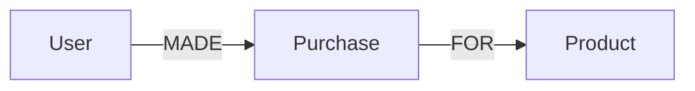

Common traps:
- Over-generic relationships—use specific (:EMAILED vs. :SENT_TO on email node).
- Ignore events as nodes—model emails as nodes for replies/forwards.
- Directionless edges—always specify for semantics.

### Explaining Over-Generic Relationships in Depth

Using vague edges like :RELATED loses semantics; specific labels enable precise queries.

Why avoid: Hard to filter, slows analysis.

Code Sample (Bad to good):
```cypher
// Bad
CREATE (a)-[":RELATED"]->(b)
// Good
CREATE (a)-[":EMAILED {date: '2025'}"]->(b)
```

```mermaid
flowchart LR
    A -->|RELATED (vague)| B
```

### Explaining Ignore Events as Nodes in Depth

Events like purchases have properties—model as nodes for relations like refunds.

Why: Captures complexity, enables paths like purchase chains.

Code Sample:
```cypher
CREATE (p:Purchase {id:1, amount:100})
CREATE (u:User)-[":MADE"]->(p)-[":FOR"]->(prod:Product)
```



### Explaining Directionless Edges in Depth

Undirected edges miss intent (e.g., who follows whom).

Why specify: Enables accurate traversals, like incoming vs. outgoing.

Code Sample:
```cypher
CREATE (a)-[":FOLLOWS"]->(b)  // Directed
```

```mermaid
flowchart LR
    A -->|FOLLOWS (directed)| B
```

How: For email fraud, start with users linked by :EMAILED. Pitfall: Misses details. Fix: Add :Email nodes with :SENT, :TO, :CC, :BCC, :REPLY_TO.

Example evolution:

```cypher
CREATE (bob:User {name:'Bob'})-[":ALIAS_OF"]->(alice:User {name:'Alice'})
CREATE (email:Email {id:1, content:'Hi Charlie...'})
CREATE (bob)-[":SENT"]->(email)-[":TO"]->(charlie:User {name:'Charlie'})
CREATE (email)-[":CC"]->(davina:User {name:'Davina'})
CREATE (reply:Reply {id:2})-[":REPLY_TO"]->(email)
MATCH (e:Email)-[":REPLY_TO*"]->(orig:Email) RETURN orig.id
```

Why? Captures complexity without shortcuts, enables deep analysis.
