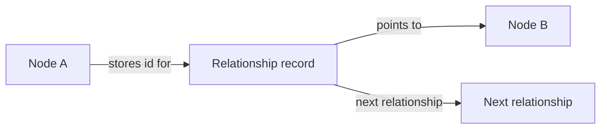
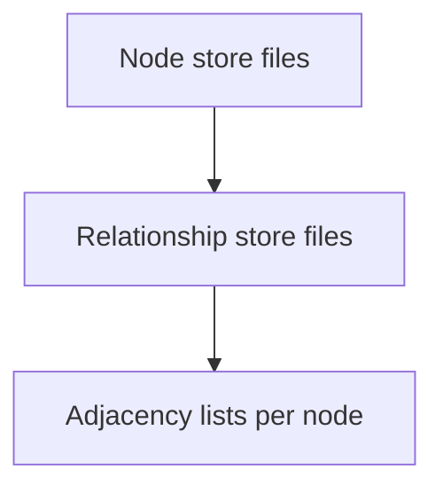
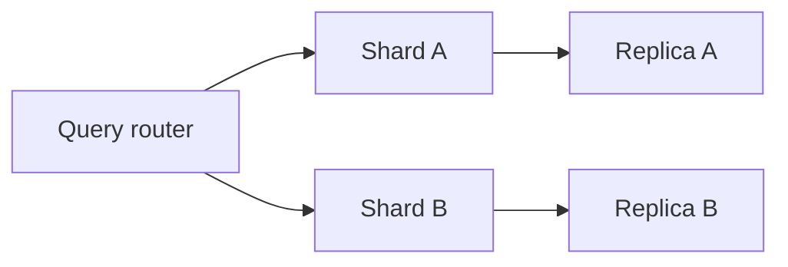
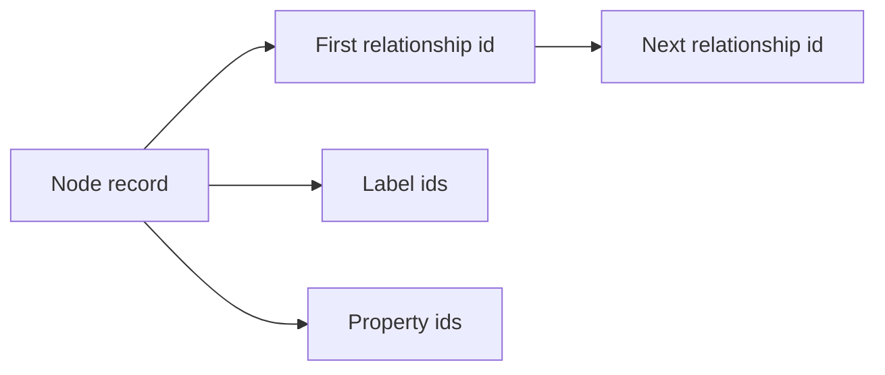

Storage optimizes traversals.

- **Native Storage**: Direct pointers (e.g., node stores outgoing edge IDs). Fast for depth-first searches. Fixed-size records for quick access.

- **Indexing**: Hash or B-tree on properties/labels. Start queries fast, then traverse.

- **Partitioning**: Divide into records (nodes separate from edges). Some use adjacency lists.

- **Distribution**: Sharding (hash nodes across servers), replication for reads. Challenges: Cross-shard queries slow.

### Explaining Native Storage in Depth

Native stores use file-based records with pointers—nodes point to relationship chains. Neo4j example: 9-byte node records, 34-byte relationship records, double-linked for bidirectionality.

Why fast: Index-free adjacency; traversal time scales with subgraph size, not database.

Code Sample (Conceptual Python simulation):
```python
class Node:
    def __init__(self, id):
        self.id = id
        self.outgoing = []

node_a = Node(1)
node_b = Node(2)
node_a.outgoing.append(node_b)  # Pointer to B
print(node_a.outgoing[0].id)  # 2
```



### Explaining Indexing in Depth

Indexes speed initial lookups (e.g., find node by name), then traversal takes over. Types: Composite for multiple properties.

Why balance: Indexes boost reads but slow writes; use judiciously.

Code Sample (Cypher index):
```cypher
CREATE INDEX ON :Person(name, age)
MATCH (p:Person {name: 'Alice'}) RETURN p
```


### Explaining Partitioning in Depth

Data split into files: node_store.db for nodes, relationship_store.db for edges. Adjacency lists group a node's edges.

Why efficient: Localized access reduces I/O for traversals.

Code Sample (Pseudo):
```python
# Simulate partitioning
nodes = {1: {'label': 'Person'}}
relationships = {1: {'from': 1, 'to': 2, 'type': 'KNOWS', 'next': 2}}
# Traverse from node 1
current = 1
while current:
    rel = relationships[current]
    print(rel['to'])
    current = rel.get('next')
```



### Explaining Distribution in Depth

Sharding partitions data across servers; replication copies for fault-tolerance. Neo4j clusters use causal consistency.

Why scalable: Handles petabyte graphs, but cross-shard traversals need optimization.

Code Sample (Conceptual cluster query):
```cypher
// Assuming distributed setup
MATCH (a:Person {name: 'Alice'})-[":KNOWS"]->(b) RETURN b  // May hit multiple shards
```



For devs: Tune indexes—overdo it, and writes suffer. Use EXPLAIN in queries to spot bottlenecks.

Why native? Index-free adjacency—queries proportional to traversed graph, not total size.

Example: In Neo4j, a node's record points to first relationship; each relationship points to next, forming chains.


