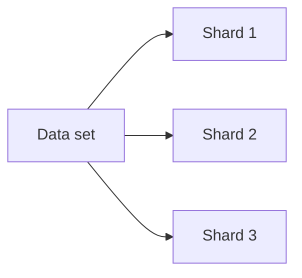
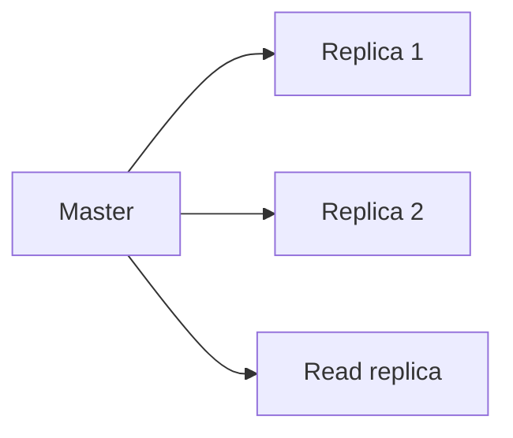
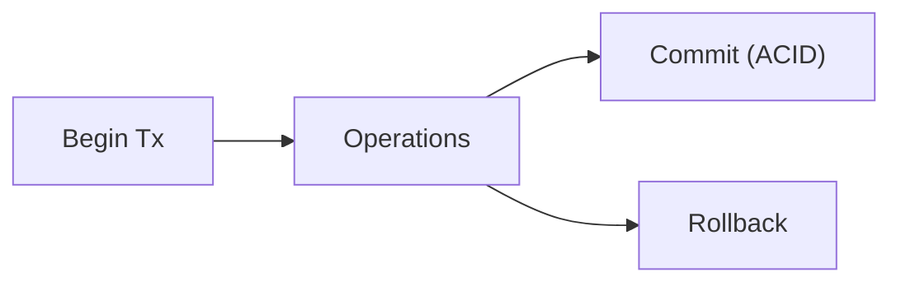

Scale out: Sharding (partition data), replication.

ETH: Support ACID? Sharding? Many do partial.

Neo4j: Causal clustering for reads/writes.

O'Reilly: Transactions ensure consistency.

Student: Balance with query needs.

Challenge: Global queries on distributed graphs.

- **Sharding**: Partition by hash or custom.
- **Replication**: Copies for failover/reads.
- **Transactions**: ACID ensures atomic commits.

### Explaining Sharding in Depth

Divides data across nodes, e.g., hash node IDs.

Why: Horizontal scale.

Code Sample (Conceptual):
```cypher
// Query may route to shard
MATCH (n) WHERE id(n) % 3 = 0 RETURN n  // Sim hash
```


### Explaining Replication in Depth

Copies data for reads, failover.

Why: High availability.

Code Sample:
```cypher
// Read from replica
MATCH (n) RETURN n
```


### Explaining Transactions in Depth

ACID: Atomic, Consistent, Isolated, Durable.

Why: Reliable ops.

Code Sample:
```python
with session.begin_transaction() as tx:
    tx.run("CREATE (n)")
    tx.success = True
```


