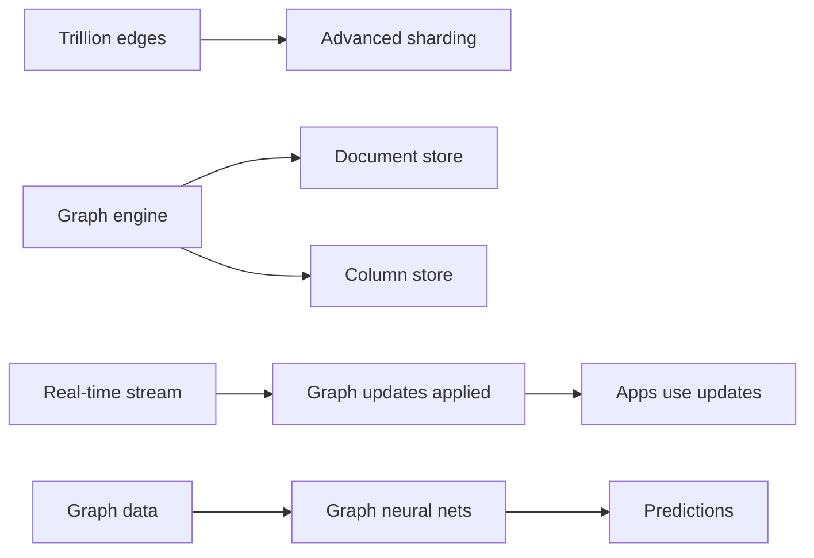

ETH outlines:

- Better distribution for massive graphs.
- Hybrid with other NoSQL.
- Streaming graphs (real-time changes).
- AI integration.

### Explaining Better Distribution in Depth

For trillion edges, advanced sharding needed.

Why: Handle web-scale.

Code Sample (Future conceptual):
```cypher
MATCH (n) DISTRIBUTED RETURN n
```

### Explaining Hybrid with Other NoSQL in Depth

Combine graph with document/column.

Why: Best of breeds.

Code Sample:
```cypher
MATCH (n) CALL document.lookup(n.id) RETURN n
```

### Explaining Streaming Graphs in Depth

Real-time updates, like Kafka integration.

Why: Dynamic data.

Code Sample:
```cypher
SUBSCRIBE TO changes CREATE (n)
```


### Explaining AI Integration in Depth

Graph neural nets for predictions.

Why: Enhanced analytics.

Code Sample (PyTorch sim):
```python
import torch
# Graph NN model
```

Neo4j: Evolving queries.

O'Reilly: More algorithms.

Student: Scalability tweaks.

Graphs are rising; tackle these for dominance.
