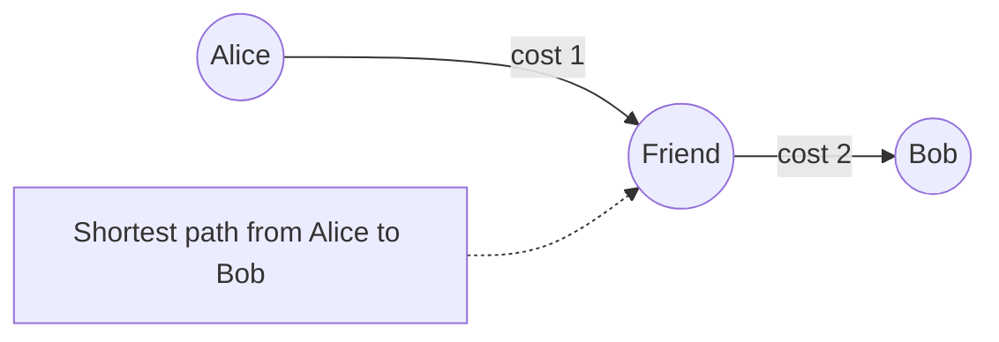
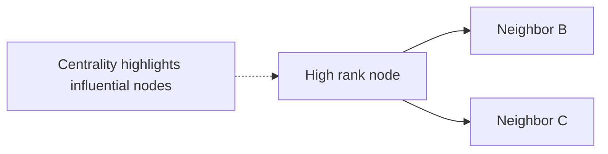
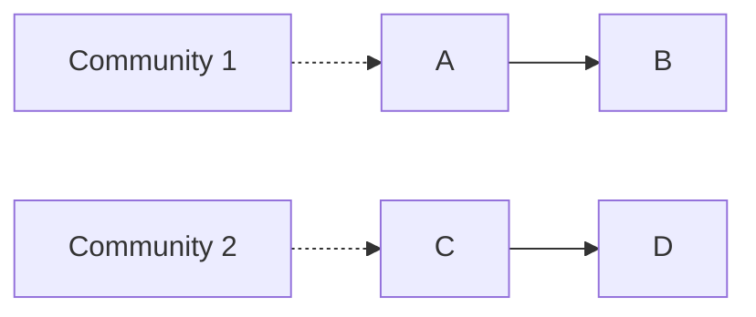
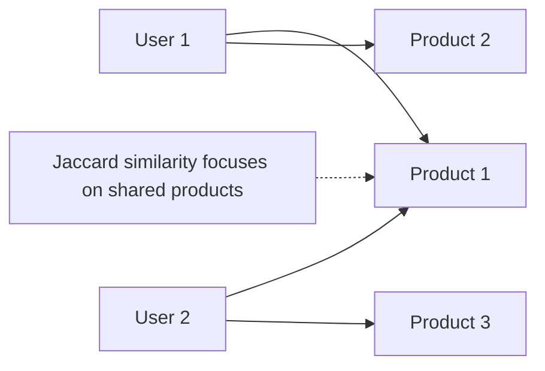

Beyond storage: Analyze.

- **Pathfinding**: ShortestPath (A* for heuristics).
- **Centrality**: PageRank for ranking.
- **Community**: Louvain for clusters.
- **Similarity**: Jaccard for node overlap.

### Explaining Pathfinding in Depth

Finds optimal routes, like Dijkstra for weighted.

Why: Logistics, social connections.

Code Sample:
```cypher
CALL algo.shortestPath('Alice', 'Bob', 'KNOWS', 'Person')
```



### Explaining Centrality in Depth

Ranks nodes by importance.

Why: Identify key players.

Code Sample:
```cypher
CALL algo.pageRank()
```



### Explaining Community in Depth

Groups densely connected nodes.

Why: Market segments.

Code Sample:
```cypher
CALL algo.louvain()
```



### Explaining Similarity in Depth

Measures overlap, for recs.

Why: Find similar users.

Code Sample:
```cypher
CALL algo.nodeSimilarity()
```



Use for insights: Recommend via common neighbors.

Example: Dijkstra in Australia graph (cities, flight hours).

```cypher
MATCH p=shortestPath((syd:City {name:'Sydney'})-[*]-(per:City {name:'Perth'}))
RETURN reduce(total=0, r in relationships(p) | total + r.hours) AS hours
```

Why: Predictive—triadic closures forecast links.
