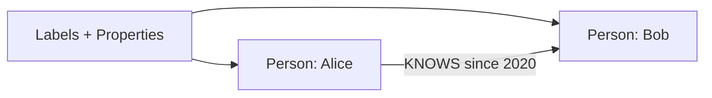
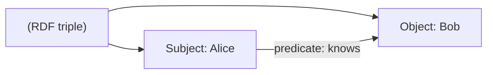
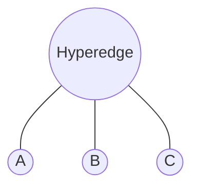
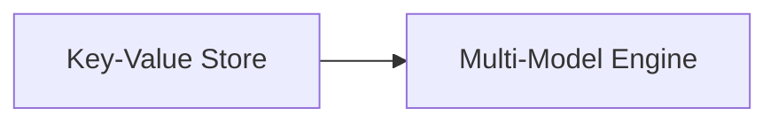

Models shape how you store and query.

- **Labeled Property Graph (LPG)**: Flexible, app-centric. Nodes/edges with labels/properties. Ideal for social, e-commerce. Query patterns like paths.
  
- **Resource Description Framework (RDF)**: Semantic web standard. Data as triples (subject-predicate-object, e.g., Alice-knows-Bob). Great for ontologies, inference. Query with SPARQL.

- **Hypergraph**: Edges link >2 nodes (e.g., a meeting with multiple attendees). Niche but powerful for complex groups.

- **Others**: Key-value graphs (simple pairs), multi-model (graph + document).

### Explaining Labeled Property Graph (LPG) in Depth

LPG allows arbitrary labels and properties on nodes/edges, making it intuitive for app developers. It's "whiteboard-friendly"—draw your domain, implement directly.

Why popular: Supports rich, flexible modeling without rigid schemas, perfect for agile dev.

Code Sample (Cypher for LPG):
```cypher
CREATE (a:Person {name:'Alice'})-[":KNOWS {since:2020}"]->(b:Person {name:'Bob'})
```



### Explaining Resource Description Framework (RDF) in Depth

RDF stores knowledge as triples, enabling semantic queries and inference (e.g., if A is type Human and Humans are Mortal, infer A is Mortal).

Why for semantics: Integrates with ontologies like OWL, great for linked data.

Code Sample (SPARQL):
```sparql
PREFIX foaf: <http://xmlns.com/foaf/0.1/>
SELECT ?name WHERE { ?person foaf:knows ?friend . ?person foaf:name ?name }
```



### Explaining Hypergraph in Depth

Hyperedges connect multiple nodes at once, modeling group relations like co-authors on a paper.

Why niche: Handles n-ary relations natively, but less common support.

Code Sample (Conceptual in Python):
```python
# Using hypernetx library (if available)
import hypernetx as hnx
hyperedges = {0: ['A', 'B', 'C']}  # One hyperedge connecting three nodes
H = hnx.Hypergraph(hyperedges)
```



### Explaining Others in Depth

Includes simple key-value (edges as pairs) or multi-model (graph + JSON docs). 

Why versatile: Combines strengths, like OrientDB's graph-document hybrid.

Code Sample (OrientDB SQL-like):
```sql
CREATE VERTEX Person SET name = 'Alice'
CREATE EDGE Knows FROM (SELECT FROM Person WHERE name='Alice') TO (SELECT FROM Person WHERE name='Bob')
```



LPG dominates for devs—whiteboard-natural. RDF for linked data integration. Hypergraphs tackle multi-party relationships, while multi-model stores mix paradigms. Choose the model that matches your data density, semantic needs, and scale requirements.
