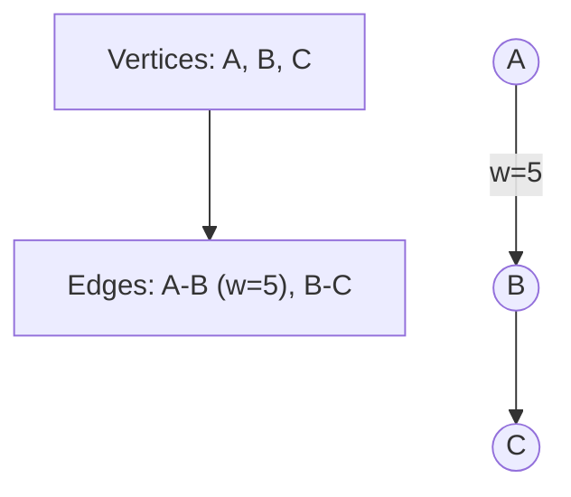
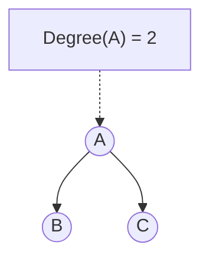
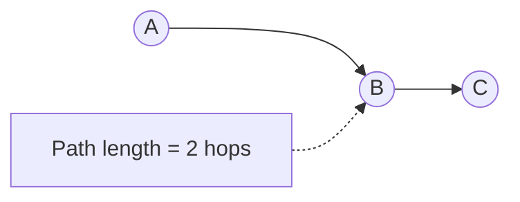
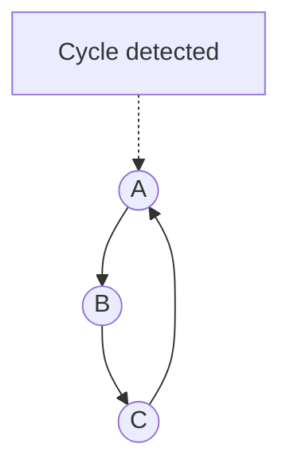
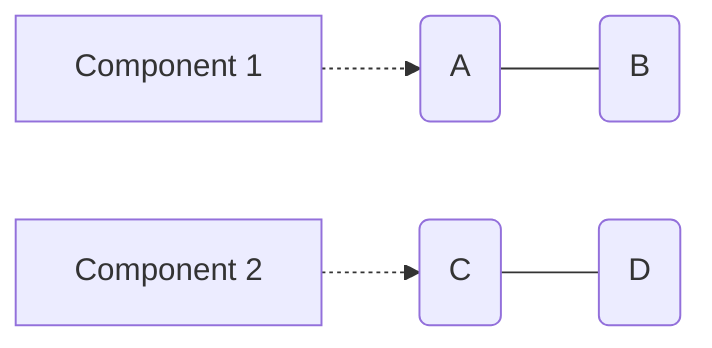
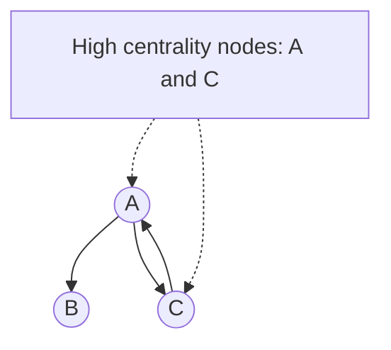
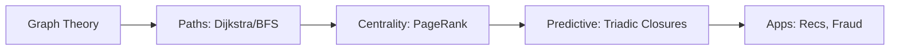

Graphs trace to Euler's 1736 bridge problem. Basics empower devs:

- **Graph G = (V, E)**: V vertices (nodes), E edges (relationships). Directed (one-way follows), undirected (mutual friends), weighted (distances).
- **Degree**: Edges per node; in/out for directed.
- **Path**: Edge sequence; length by hops or weights.
- **Cycle**: Looping path—detect for fraud.
- **Connected Component**: Mutually reachable subgraph.
- **Centrality**: Degree (local hubs), betweenness (bridges), PageRank (influence, as in Google).

### Explaining Graph G = (V, E) in Depth

The fundamental structure: V is the set of nodes (e.g., users), E the set of edges (e.g., friendships). Directed graphs have arrows for one-way relations like "follows"; undirected for symmetric like "spouse". Weighted add values, like edge costs in routing.

Why foundational: Defines all graph ops. In apps, choose directed for social media, weighted for maps.

Code Sample (NetworkX for basic graph):
```python
import networkx as nx
G = nx.DiGraph()
G.add_edge('A', 'B', weight=5)
print(G.nodes)  # ['A', 'B']
print(G.edges(data=True))  # ["('A', 'B', {'weight': 5})"]
```



### Explaining Degree in Depth

Degree counts connections per node—high-degree nodes are hubs. In directed graphs, in-degree (incoming) measures popularity; out-degree activity.

Why useful: Identifies influencers or bottlenecks. In social nets, high out-degree might flag spammers.

Code Sample:
```python
import networkx as nx
G = nx.Graph()
G.add_edges_from([('A', 'B'), ('A', 'C')])
print(nx.degree(G, 'A'))  # 2
```



### Explaining Path in Depth

A path is a sequence without repeats; length by hops or sum weights. Shortest paths minimize this, crucial for navigation.

Why key: Enables "degrees of separation" queries, like LinkedIn connections.

Code Sample (Shortest path):
```python
import networkx as nx
G = nx.Graph()
G.add_edges_from([('A', 'B'), ('B', 'C')])
print(nx.shortest_path(G, 'A', 'C'))  # ['A', 'B', 'C']
```



### Explaining Cycle in Depth

Cycles loop back, indicating redundancy or issues like deadlocks.

Why detect: Fraud (money cycles), dependency loops in software.

Code Sample:
```python
import networkx as nx
G = nx.DiGraph([('A', 'B'), ('B', 'C'), ('C', 'A')])
print(nx.find_cycle(G))  # [('A', 'B'), ('B', 'C'), ('C', 'A')]
```



### Explaining Connected Component in Depth

Subgraphs where every pair is path-connected; finds clusters.

Why: Analyzes network partitions, like isolated user groups.

Code Sample:
```python
import networkx as nx
G = nx.Graph()
G.add_edges_from([('A', 'B'), ('C', 'D')])
print(list(nx.connected_components(G)))  # [{'A', 'B'}, {'C', 'D'}]
```



### Explaining Centrality in Depth

Measures node importance: Degree for locals, betweenness for controllers, PageRank for global.

Why: Prioritizes nodes in marketing or traffic.

Code Sample (PageRank):
```python
import networkx as nx
G = nx.DiGraph([('A', 'B'), ('A', 'C'), ('C', 'A')])
print(nx.pagerank(G))  # {'A': 0.37, 'B': 0.26, 'C': 0.37}
```



Apply: Dijkstra for weighted shortest paths; BFS for unweighted. Theory predicts: Triadic closures (A-B, A-C imply B-C); structural balance (stable friend/enemy triangles).

In Python (using networkx):

```python
import networkx as nx

G = nx.Graph()
G.add_edges_from([('A', 'B'), ('A', 'C'), ('B', 'D')])
print(nx.shortest_path(G, 'A', 'D'))  # Output: ['A', 'B', 'D']
print(nx.degree_centrality(G))  # {'A': 0.666, 'B': 0.333, ...}
```

Why theory? Guides modeling—use centrality for influencer targeting.


