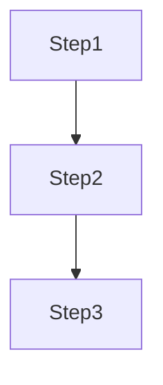
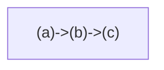

Imperative: Step-by-step (Gremlin).

Declarative: What you want (Cypher).

Neo4j: Declarative faster to write, optimize.

ETH: Both in use.

O'Reilly: Declarative aligns with agile.

Choose declarative for accessibility.

- **Imperative**: Control flow (Gremlin loops).
- **Declarative**: Pattern-match (Cypher auto-optimizes).

### Explaining Imperative in Depth

Explicit steps, good for custom.

Why: Precise control.

Code Sample:
```groovy
g.V().has('name', 'Alice').out().out()
```



### Explaining Declarative in Depth

Describe result, optimizer handles.

Why: Simpler, efficient.

Code Sample:
```cypher
MATCH (a)-[]->(b)-[]->(c) RETURN c
```


