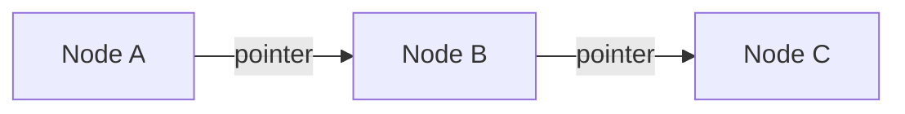
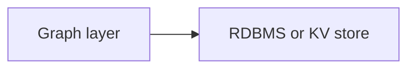
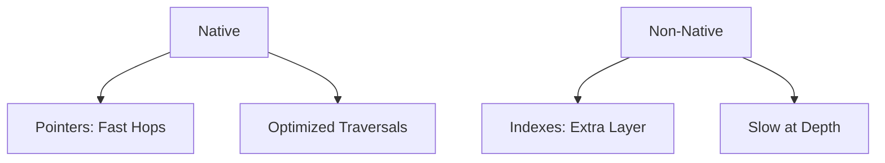

- **Native**: Engine built for graphs (pointer-based storage). Traversals fly.
- **Non-Native**: Graph layer on other stores. Simulate edges—slow for depth.

### Explaining Native in Depth

Purpose-built, with direct pointers for hops.

Why superior: Real-time on large graphs.

Code Sample (Neo4j native traversal):
```cypher
MATCH (a)-[*]->(b) RETURN path
```



### Explaining Non-Native in Depth

Overlays like SQL graphs; use indexes for simulation.

Why limited: Depth causes join explosions.

Code Sample (SQL graph sim):
```sql
SELECT * FROM nodes n JOIN edges e ON n.id = e.from_id
```



Go native for production—non-native hits walls at scale.


