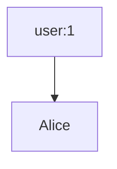
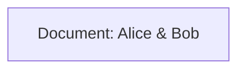
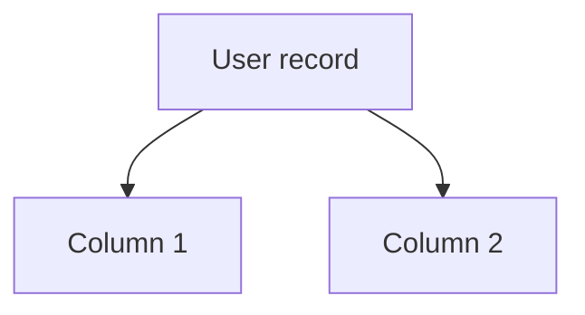

NoSQL handles variety/scale. Types:
- Key-Value: Fast lookups (Redis).
- Document: Nested structures (MongoDB).
- Column: Analytics (Cassandra).
- Graph: Relationships (Neo4j).

### Explaining Key-Value in Depth

Simple stores like key to value, great for caches.

Why fit: Graphs can layer on them but add relations.

Code Sample (Redis sim):
```python
import redis
r = redis.Redis()
r.set('user:1', 'Alice')
print(r.get('user:1'))
```



### Explaining Document in Depth

JSON-like with nesting, for semi-structured data.

Why: Graphs extend with links between docs.

Code Sample (Mongo sim):
```python
from pymongo import MongoClient
client = MongoClient()
db = client.test
db.users.insert_one({'name': 'Alice', 'friends': ['Bob']})
```



### Explaining Column in Depth

Wide rows for time-series, analytics.

Why: Graphs for connected analytics.

Code Sample (Cassandra sim):
```python
# Conceptual
row = {'user_id': 1, 'col1': 'value1', 'col2': 'value2'}
```



### Explaining Graph in Depth

Focus on relations, as detailed earlier.

Why standout: Native for connected data.

Graphs are NoSQL with ACID options. vs BASE: ACID for consistency (e.g., bank transfers); BASE for availability (eventual consistency).

Why graphs? Handle connected variety better than aggregates.

Tour: Aggregates group data (e.g., order with items); graphs link freely.
