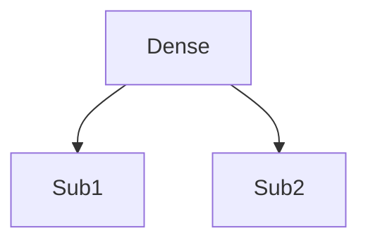
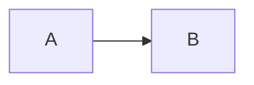
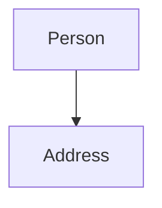
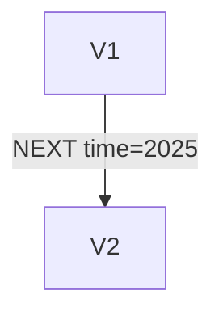

- Dense nodes: Fan-out kills perf—split or index.
- Wrong direction: Always specify -> or <-.
- Over-properties: Keep lean; use nodes for complex.
- No versioning: Model history with timed edges.

### Explaining Dense Nodes in Depth

Nodes with thousands of edges slow traversals; split into sub-nodes.

Why avoid: Memory/per f issues.

Code Sample:
```cypher
// Split dense
CREATE (hub:Hub) -[":PART_OF"]-> (sub:SubNode)
```



### Explaining Wrong Direction in Depth

Missing direction confuses semantics.

Why: Wrong query results.

Code Sample:
```cypher
(a)-[":KNOWS"]->(b)  // Correct
```



### Explaining Over-Properties in Depth

Too many props per node bloats; use related nodes.

Why: Better organization.

Code Sample:
```cypher
CREATE (p:Person)-[":HAS_ADDRESS"]->(addr:Address {street: '123 Main'})
```



### Explaining No Versioning in Depth

For history, use timed edges or version nodes.

Why: Track changes.

Code Sample:
```cypher
CREATE (v1:Version {state: 'old'})-[":NEXT {time: '2025'}"]->(v2:Version {state: 'new'})
```



Test with load—simulate growth.

Why: Prevents perf hits.
