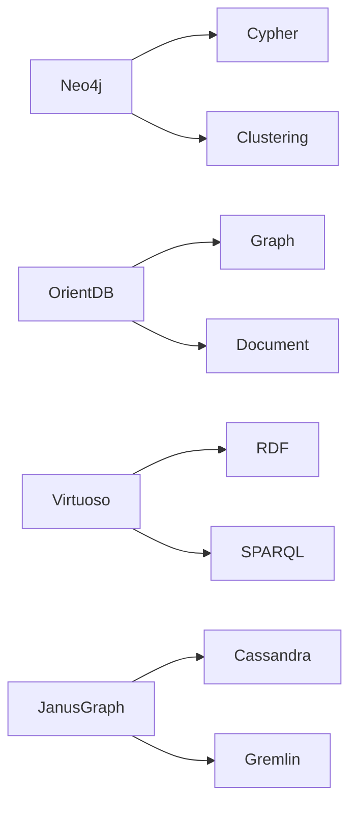

51 from taxonomy, but highlights:

- **Neo4j**: Native LPG, Cypher, enterprise-ready.
- **OrientDB**: Multi-model (graph + document).
- **Virtuoso**: RDF focus.
- **JanusGraph**: Distributed, on Cassandra.

### Explaining Neo4j in Depth

Leading native LPG with Cypher, ACID, clustering for scale.

Why top: Mature ecosystem, high perf.

Code Sample:
```cypher
MATCH (n) RETURN n
```

### Explaining OrientDB in Depth

Combines graph, document, key-value.

Why versatile: Multi-paradigm apps.

Code Sample (Orient SQL):
```sql
SELECT FROM V
```

### Explaining Virtuoso in Depth

RDF/triple store with SPARQL.

Why semantic: Linked data.

Code Sample (SPARQL):
```sparql
SELECT * WHERE { ?s ?p ?o }
```

### Explaining JanusGraph in Depth

Scalable on backends like Cassandra.

Why big data: Distributed processing.

Code Sample (Gremlin):
```groovy
g.V()
```



Compare:

| DB          | Model | Native? | Query Lang | Strengths          |
|-------------|-------|---------|------------|--------------------|
| Neo4j      | LPG   | Yes     | Cypher     | Speed, flexibility |
| OrientDB   | Multi | Yes     | SQL-like   | Versatile          |
| Virtuoso   | RDF   | No      | SPARQL     | Semantic web       |
| JanusGraph | LPG   | Yes     | Gremlin    | Distributed        |
