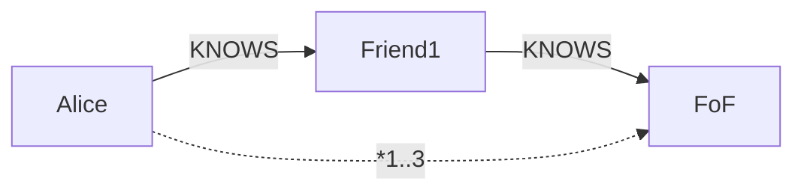
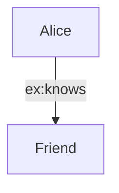

Queries pattern-match paths.

- **Cypher**: Declarative (Neo4j). Describe what, engine optimizes how.
  Example: Find friends-of-friends.
  ```
  MATCH (p:Person)-[":KNOWS"]->(friend)-[":KNOWS"]->(fof)
  WHERE p.name = 'Alice' AND NOT (p)-[":KNOWS"]->(fof)
  RETURN fof.name
  ```

- **Gremlin**: Imperative (TinkerPop). Step-by-step: g.V().has('name', 'Alice').out('KNOWS').out('KNOWS').

- **SPARQL**: For RDF. SELECT ?fof WHERE { ?p :name "Alice" . ?p :KNOWS ?friend . ?friend :KNOWS ?fof . FILTER(?p != ?fof) }

### Explaining Cypher in Depth

Cypher is human-readable, declarative—focus on patterns, not steps. Clauses: MATCH for patterns, CREATE for writes, RETURN for outputs.

Why accessible: Reads like English, auto-optimized for perf.

Code Sample (Variable-length path):
```cypher
MATCH (a:Person {name: 'Alice'})-[":KNOWS*1..3"]->(contact)
RETURN contact.name, length(path) AS degrees
```



### Explaining Gremlin in Depth

Gremlin is traversal-based, imperative—chain steps like .out() for outgoing edges.

Why flexible: Fine control for complex logic, portable across DBs.

Code Sample (Groovy-style):
```groovy
g.V().has('name', 'Alice').repeat(out('KNOWS')).times(2).path()
```

```mermaid
flowchart TD
    Start["V: Alice"] -->|out(KNOWS)| Step1[Friend]
    Step1 -->|out(KNOWS)| Step2[FoF]
```

### Explaining SPARQL in Depth

SPARQL queries RDF triples with SELECT/WHERE, supporting inference.

Why for semantics: Handles namespaces, filters complex conditions.

Code Sample:
```sparql
PREFIX ex: <http://example.org/>
SELECT ?friend WHERE { ex:Alice ex:knows ?friend }
```



Declarative wins for readability—write once, run anywhere. Add WHERE for filters, ORDER BY for sorting, LIMIT for paging.

Advanced: Variable-length paths (e.g., (p)-[*2..4]->(target) for 2-4 hops), aggregations (COUNT, AVG).
