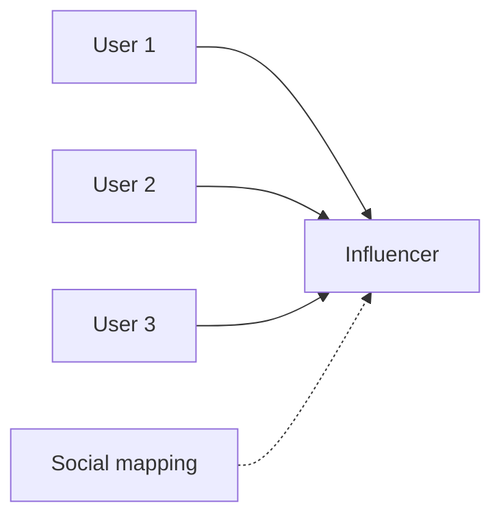
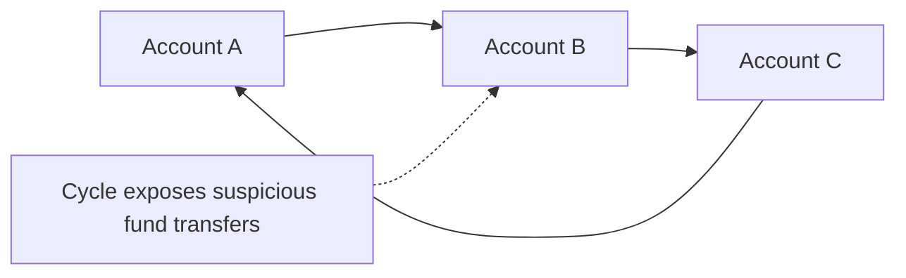
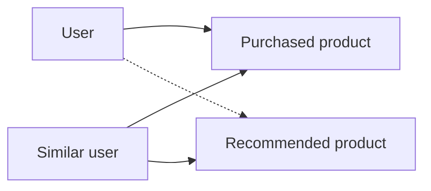
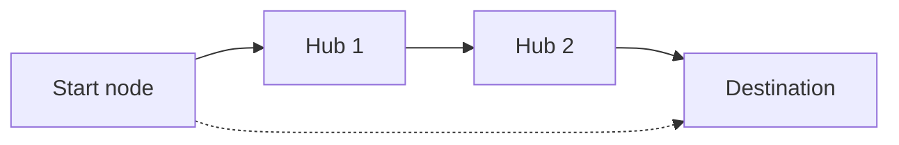
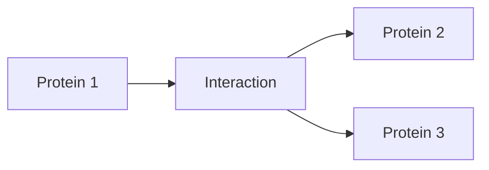
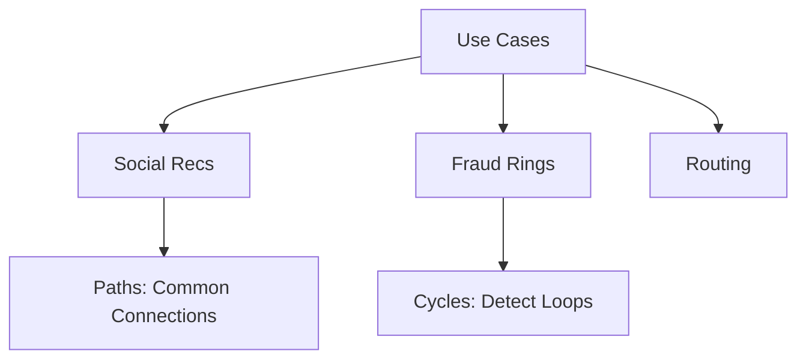

- **Social**: Influence mapping.
- **Fraud**: Cycle detection.
- **Recs**: "People who bought this..."
- **Networks**: Routes, failures.
- **Bio**: Protein interactions.

### Explaining Social in Depth

Map influences via centrality.

Why: Targeted marketing.

Code Sample:
```cypher
MATCH (u:User)-[":FOLLOWS"]->(influencer)
RETURN influencer, count(u) ORDER BY count(u) DESC
```



### Explaining Fraud in Depth

Detect cycles for rings.

Why: Prevent losses.

Code Sample:
```cypher
MATCH p=(a)-[*3..]-(a) RETURN p
```



### Explaining Recs in Depth

Collaborative filtering via paths.

Why: Boost sales.

Code Sample:
```cypher
MATCH (u:User)-[":BOUGHT"]->(p)<-[":BOUGHT"]-(other)-[":BOUGHT"]->(rec)
RETURN rec
```



### Explaining Networks in Depth

Route optimization.

Why: Efficiency.

Code Sample:
```cypher
MATCH p=shortestPath((start)-[*]-(end)) RETURN p
```



### Explaining Bio in Depth

Interaction paths.

Why: Drug discovery.

Code Sample:
```cypher
MATCH (prot1:Protein)-[":INTERACTS*"]-(prot2) RETURN path
```



Real wins: Banks save millions spotting fraud graphs.


