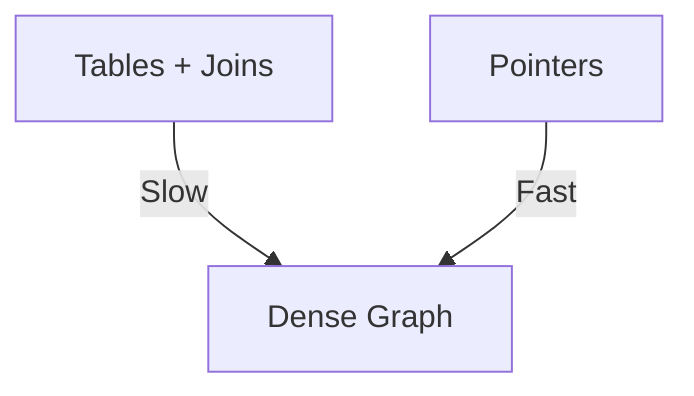
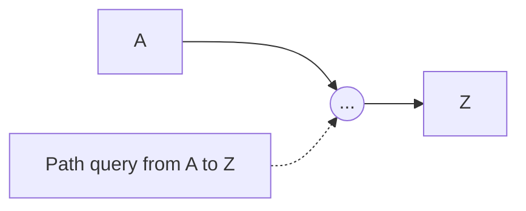

RDBMS: ACID-strong, but joins kill performance on connected data. Query cost grows with depth—O(n^d) worst-case.

Graphs: Index-free adjacency—follow pointers, O(1) per edge. Scales to billions of nodes.

When to switch:
- High relationship density.
- Frequent path queries.
- Evolving schema.

### Explaining High Relationship Density in Depth

In dense graphs (e.g., social with avg 150 connections), RDBMS joins explode tables.

Why switch: Graphs handle without perf loss.

Code Sample (RDBMS sim vs graph):
```sql
-- RDBMS slow join
SELECT * FROM users u JOIN friends f ON u.id = f.user_id JOIN users friend ON f.friend_id = friend.id
```

```cypher
-- Graph fast
MATCH (u:User)-[":FRIENDS"]->(friend) RETURN friend
```



### Explaining Frequent Path Queries in Depth

Paths like "route from A to Z" are common; RDBMS recursive queries lag.

Why graphs: Built-in algos like shortestPath.

Code Sample:
```cypher
MATCH p=shortestPath((a)-[*]-(z)) RETURN p
```



### Explaining Evolving Schema in Depth

Add columns in RDBMS requires ALTER; graphs add properties ad hoc.

Why agile: No downtime for changes.

Code Sample:
```cypher
MATCH (n) SET n.newProp = 'value'
```


Hybrid: Use graphs for connections, RDBMS for transactions.

How: Migrate—import CSV to nodes/edges.

```python
# Python with neo4j driver
from neo4j import GraphDatabase
driver = GraphDatabase.driver("bolt://localhost")
with driver.session() as session:
    session.run("LOAD CSV FROM 'file:///users.csv' AS row CREATE (:User {name: row.name})")
```

Why? Scales with relationships, agile dev.
