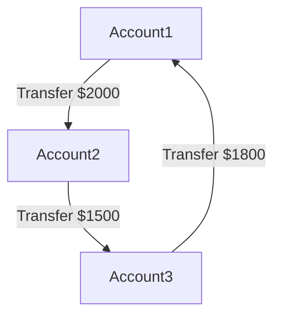
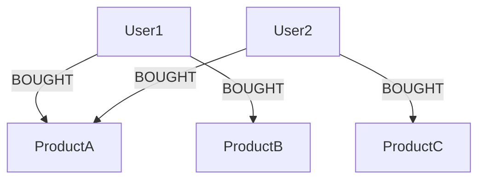
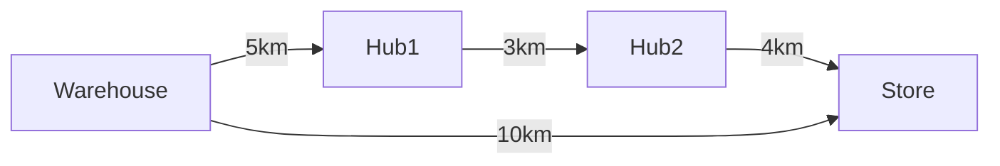

Real data thrives on relationships. Social networks link users via follows; web graphs connect pages with hyperlinks; biological pathways tie proteins. RDBMS store this, but deep queries explode—joins scale poorly with depth, hitting O(n^d) in worst cases.

Graphs excel: Handle irregular, trillion-edge datasets that evolve, rich with properties like timestamps or weights. Why? Native storage follows pointers, not scans—constant time per hop.

Use cases abound:
- **Fraud Detection**: Cycles reveal rings; banks save billions spotting hidden links.
- **Recommendations**: Traverse "bought-together" paths for real-time suggestions.
- **Network Analysis**: Shortest paths optimize routes in logistics.

### Explaining Fraud Detection in Depth

Fraud detection leverages graphs to uncover patterns invisible in tabular data. For instance, in financial systems, a ring of accounts transferring money in cycles might indicate money laundering. Graphs model accounts as nodes and transactions as directed, weighted edges (with amounts and dates). Queries detect cycles efficiently, unlike RDBMS where recursive joins would timeout on large datasets.

Why it works: Graph traversals follow relationships naturally, scaling to millions of nodes without performance degradation. In practice, institutions like banks use this to flag suspicious activity in real-time, saving billions annually by preventing losses.

Code Sample (Cypher for cycle detection):
```cypher
MATCH p=(a:Account)-[":TRANSFERS_TO*3..5"]->(a)
WHERE all(r in relationships(p) WHERE r.amount > 1000)
RETURN p
```
This finds cycles of 3-5 transfers back to the start, filtering high-value ones.



### Explaining Recommendations in Depth

Recommendation engines use graphs to suggest items based on user behavior paths. For e-commerce, users are nodes, products are nodes, and interactions (views, purchases) are edges. Traversing "users who bought X also bought Y" paths generates personalized suggestions quickly.

Why superior: Unlike matrix factorization in RDBMS (which requires recomputing large tables), graphs handle dynamic updates—add an edge for a new purchase without rebuilding. This enables real-time recs, boosting conversion rates.

Code Sample (Python with Neo4j driver for common purchases):
```python
from neo4j import GraphDatabase

driver = GraphDatabase.driver("bolt://localhost:7687", auth=("neo4j", "password"))

def get_recs(tx, user_id):
    result = tx.run("""
        MATCH (u:User {id: $user_id})-[":BOUGHT"]->(p:Product)<-[":BOUGHT"]-(other:User)-[":BOUGHT"]->(rec:Product)
        WHERE NOT (u)-[":BOUGHT"]->(rec)
        RETURN rec.name, count(*) AS strength ORDER BY strength DESC LIMIT 5
    """, user_id=user_id)
    return [record["rec.name"] for record in result]

with driver.session() as session:
    recs = session.execute_read(get_recs, "user123")
    print(recs)
```



### Explaining Network Analysis in Depth

Network analysis in graphs optimizes paths, like routing in telecom or logistics. Nodes represent locations, edges are routes with weights (distance, time). Algorithms find shortest paths, identifying bottlenecks or failures.

Why effective: Graphs model topology naturally; queries like "find alternative routes if edge fails" run in milliseconds, vs. RDBMS scans. Used in GPS apps or supply chains to minimize costs.

Code Sample (Cypher for shortest path):
```cypher
MATCH (start:Location {name: 'Warehouse'}), (end:Location {name: 'Store'})
MATCH p = shortestPath((start)-[*]-(end))
RETURN reduce(totalDist = 0, r in relationships(p) | totalDist + r.distance) AS totalDistance
```



Performance: In a 1M-user social graph (avg 50 friends), friends-of-friends (depth 2) takes 0.016s in RDBMS vs. 0.01s in Neo4j; depth 5: unfinished vs. 2.132s. Flexibility: Add edges without schema migrations. Agility: Evolve models iteratively.

If your domain has many-to-many ties, graphs cut query times dramatically. They're not a fad—Gartner sees "sustainable competitive advantage" in leveraging social, intent, consumption graphs.
