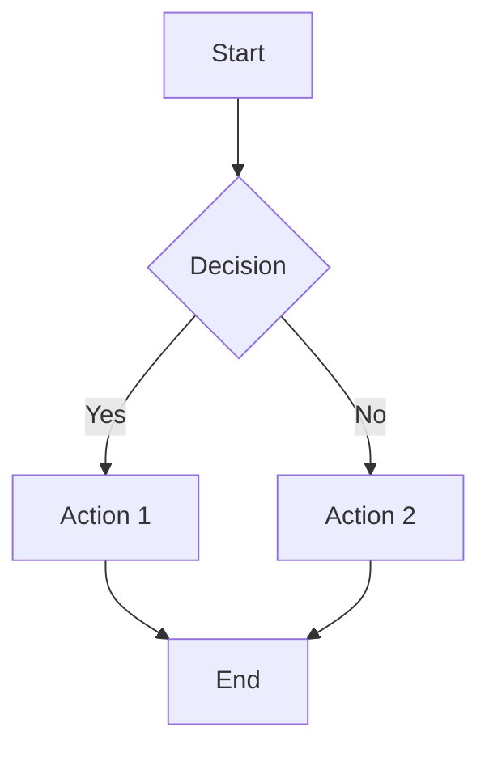

Welcome to the Graph Technology Developers educational resources repository.

This template provides a clean, minimal foundation for publishing technical documentation and educational content with:

- **Mobile-responsive design** that works beautifully on all devices
- **SEO optimization** for better discoverability
- **AI-friendly structure** for enhanced readability by AI agents
- **Code syntax highlighting** for multiple programming languages
- **Diagram support** via Mermaid.js for technical visualizations
- **Dark mode** support via `prefers-color-scheme`

## Getting Started

1. Clone or fork this repository
2. Update `_config.yml` with your repository details:
   - Set `url` to `https://{username}.github.io`
   - Set `baseurl` to `/{repository-name}` (or `""` for user/org sites)
   - Update `title` and `description`
3. Customize the footer links in `_includes/footer.html` if needed
4. Add your content as Markdown files in the root or `pages/` directory
5. Push to GitHub and enable GitHub Pages in your repository settings

## Adding Content

Create new pages by adding `.md` files anywhere in the repository. They'll automatically use the page layout.

Example:

```markdown
---
title: My New Page
---

# My New Page

Your content here...
```

## Code Examples

Use code fences for syntax highlighting:

```python
def hello_graph():
    print("Hello, Graph World!")
```

```cypher
MATCH (n:Person)-[:KNOWS]->(m:Person)
RETURN n, m
```

## Diagrams

Use Mermaid for technical diagrams:



## Learn More

Visit [Graph Technology Developers](https://graphtech.dev/) for more resources and community discussions.

