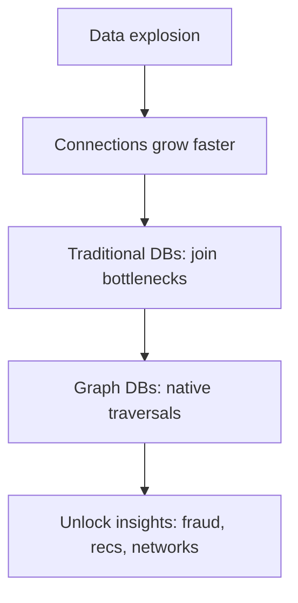

---
---

Graphs model the interconnected fabric of real-world data—from social ties to supply chains, biological networks to fraud patterns. Traditional databases like RDBMS handle structured rows well, but as relationships proliferate, queries bog down with expensive joins. Graph databases prioritize these connections, delivering fast traversals even in massive, evolving datasets.

This manual expands on core concepts for developers, blending theory with practical how-tos. Expect deeper dives into modeling, querying, and implementation, with code samples in Cypher and Python, plus Mermaid diagrams for clarity. It's distilled from key sources but written briskly: why graphs outperform alternatives, how to build and query them, and tips for real apps.

Data explodes, but value lies in links. Spot fraud rings via cycles; recommend via paths. Ignore graphs, and your systems miss hidden insights. Let's build one.

## Start Reading

[**View the complete book →**]({{ "/book" | relative_url }})

Or jump to a chapter:



- [{{ ch.order }}. {{ ch.title }}]({{ ch.url }})


[View all chapters →]({{ "/book" | relative_url }})

## About This Book

This manual covers everything from fundamental graph theory to practical implementation:

- **Why graphs matter** - Understanding when and why to use graph databases
- **Core concepts** - Nodes, edges, properties, and relationships
- **Query languages** - Cypher, Gremlin, and SPARQL
- **Data modeling** - Best practices and common pitfalls
- **Real-world applications** - Fraud detection, recommendations, network analysis
- **Popular databases** - Neo4j, OrientDB, Virtuoso, JanusGraph
- **Getting started** - Hands-on examples with Neo4j

## Learn More

Visit [Graph Technology Developers](https://graphtech.dev/) for more resources and community discussions.
