# A Brief Introduction to Graph Databases

## Welcome to Connected Data

Graphs model the interconnected fabric of real-world data—from social ties to supply chains, biological networks to fraud patterns. Traditional databases like RDBMS handle structured rows well, but as relationships proliferate, queries bog down with expensive joins. Graph databases prioritize these connections, delivering fast traversals even in massive, evolving datasets.

This manual expands on core concepts for developers, blending theory with practical how-tos. Expect deeper dives into modeling, querying, and implementation, with code samples in Cypher and Python, plus Mermaid diagrams for clarity. It's distilled from key sources but written briskly: why graphs outperform alternatives, how to build and query them, and tips for real apps.

Data explodes, but value lies in links. Spot fraud rings via cycles; recommend via paths. Ignore graphs, and your systems miss hidden insights. Let's build one.

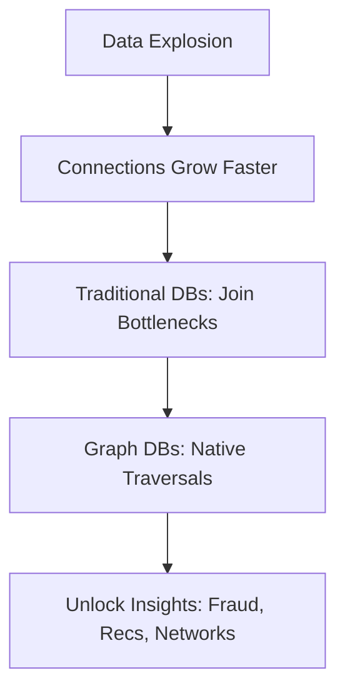

## Why Graphs Matter

Real data thrives on relationships. Social networks link users via follows; web graphs connect pages with hyperlinks; biological pathways tie proteins. RDBMS store this, but deep queries explode—joins scale poorly with depth, hitting O(n^d) in worst cases.

Graphs excel: Handle irregular, trillion-edge datasets that evolve, rich with properties like timestamps or weights. Why? Native storage follows pointers, not scans—constant time per hop.

Use cases abound:
- **Fraud Detection**: Cycles reveal rings; banks save billions spotting hidden links.
- **Recommendations**: Traverse "bought-together" paths for real-time suggestions.
- **Network Analysis**: Shortest paths optimize routes in logistics.

### Explaining Fraud Detection in Depth

Fraud detection leverages graphs to uncover patterns invisible in tabular data. For instance, in financial systems, a ring of accounts transferring money in cycles might indicate money laundering. Graphs model accounts as nodes and transactions as directed, weighted edges (with amounts and dates). Queries detect cycles efficiently, unlike RDBMS where recursive joins would timeout on large datasets.

Why it works: Graph traversals follow relationships naturally, scaling to millions of nodes without performance degradation. In practice, institutions like banks use this to flag suspicious activity in real-time, saving billions annually by preventing losses.

Code Sample (Cypher for cycle detection):
```cypher
MATCH p=(a:Account)-[":TRANSFERS_TO*3..5"]->(a)
WHERE all(r in relationships(p) WHERE r.amount > 1000)
RETURN p
```
This finds cycles of 3-5 transfers back to the start, filtering high-value ones.

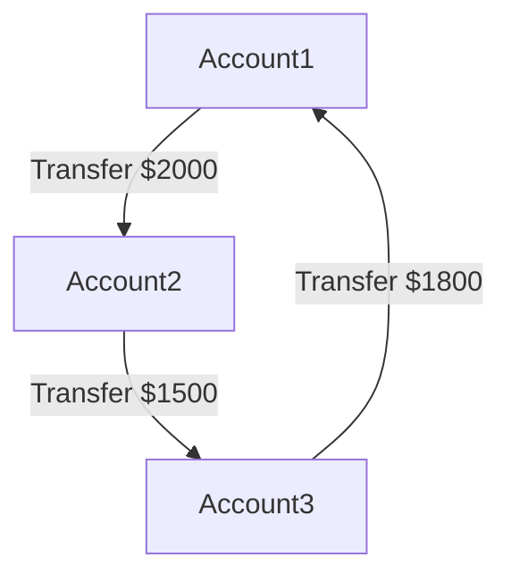

### Explaining Recommendations in Depth

Recommendation engines use graphs to suggest items based on user behavior paths. For e-commerce, users are nodes, products are nodes, and interactions (views, purchases) are edges. Traversing "users who bought X also bought Y" paths generates personalized suggestions quickly.

Why superior: Unlike matrix factorization in RDBMS (which requires recomputing large tables), graphs handle dynamic updates—add an edge for a new purchase without rebuilding. This enables real-time recs, boosting conversion rates.

Code Sample (Python with Neo4j driver for common purchases):
```python
from neo4j import GraphDatabase

driver = GraphDatabase.driver("bolt://localhost:7687", auth=("neo4j", "password"))

def get_recs(tx, user_id):
    result = tx.run("""
        MATCH (u:User {id: $user_id})-[":BOUGHT"]->(p:Product)<-[":BOUGHT"]-(other:User)-[":BOUGHT"]->(rec:Product)
        WHERE NOT (u)-[":BOUGHT"]->(rec)
        RETURN rec.name, count(*) AS strength ORDER BY strength DESC LIMIT 5
    """, user_id=user_id)
    return [record["rec.name"] for record in result]

with driver.session() as session:
    recs = session.execute_read(get_recs, "user123")
    print(recs)
```

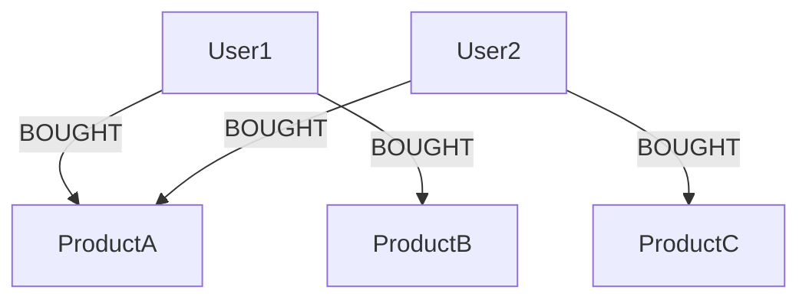

### Explaining Network Analysis in Depth

Network analysis in graphs optimizes paths, like routing in telecom or logistics. Nodes represent locations, edges are routes with weights (distance, time). Algorithms find shortest paths, identifying bottlenecks or failures.

Why effective: Graphs model topology naturally; queries like "find alternative routes if edge fails" run in milliseconds, vs. RDBMS scans. Used in GPS apps or supply chains to minimize costs.

Code Sample (Cypher for shortest path):
```cypher
MATCH (start:Location {name: 'Warehouse'}), (end:Location {name: 'Store'})
MATCH p = shortestPath((start)-[*]-(end))
RETURN reduce(totalDist = 0, r in relationships(p) | totalDist + r.distance) AS totalDistance
```

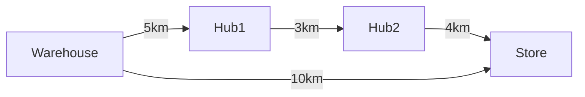

Performance: In a 1M-user social graph (avg 50 friends), friends-of-friends (depth 2) takes 0.016s in RDBMS vs. 0.01s in Neo4j; depth 5: unfinished vs. 2.132s. Flexibility: Add edges without schema migrations. Agility: Evolve models iteratively.

If your domain has many-to-many ties, graphs cut query times dramatically. They're not a fad—Gartner sees "sustainable competitive advantage" in leveraging social, intent, consumption graphs.

## Graph Theory Primer

Graphs trace to Euler's 1736 bridge problem. Basics empower devs:

- **Graph G = (V, E)**: V vertices (nodes), E edges (relationships). Directed (one-way follows), undirected (mutual friends), weighted (distances).
- **Degree**: Edges per node; in/out for directed.
- **Path**: Edge sequence; length by hops or weights.
- **Cycle**: Looping path—detect for fraud.
- **Connected Component**: Mutually reachable subgraph.
- **Centrality**: Degree (local hubs), betweenness (bridges), PageRank (influence, as in Google).

### Explaining Graph G = (V, E) in Depth

The fundamental structure: V is the set of nodes (e.g., users), E the set of edges (e.g., friendships). Directed graphs have arrows for one-way relations like "follows"; undirected for symmetric like "spouse". Weighted add values, like edge costs in routing.

Why foundational: Defines all graph ops. In apps, choose directed for social media, weighted for maps.

Code Sample (NetworkX for basic graph):
```python
import networkx as nx
G = nx.DiGraph()
G.add_edge('A', 'B', weight=5)
print(G.nodes)  # ['A', 'B']
print(G.edges(data=True))  # ["('A', 'B', {'weight': 5})"]
```

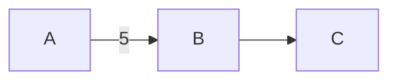

### Explaining Degree in Depth

Degree counts connections per node—high-degree nodes are hubs. In directed graphs, in-degree (incoming) measures popularity; out-degree activity.

Why useful: Identifies influencers or bottlenecks. In social nets, high out-degree might flag spammers.

Code Sample:
```python
import networkx as nx
G = nx.Graph()
G.add_edges_from([('A', 'B'), ('A', 'C')])
print(nx.degree(G, 'A'))  # 2
```

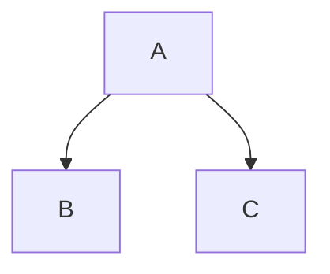

### Explaining Path in Depth

A path is a sequence without repeats; length by hops or sum weights. Shortest paths minimize this, crucial for navigation.

Why key: Enables "degrees of separation" queries, like LinkedIn connections.

Code Sample (Shortest path):
```python
import networkx as nx
G = nx.Graph()
G.add_edges_from([('A', 'B'), ('B', 'C')])
print(nx.shortest_path(G, 'A', 'C'))  # ['A', 'B', 'C']
```

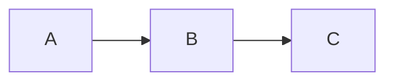

### Explaining Cycle in Depth

Cycles loop back, indicating redundancy or issues like deadlocks.

Why detect: Fraud (money cycles), dependency loops in software.

Code Sample:
```python
import networkx as nx
G = nx.DiGraph([('A', 'B'), ('B', 'C'), ('C', 'A')])
print(nx.find_cycle(G))  # [('A', 'B'), ('B', 'C'), ('C', 'A')]
```

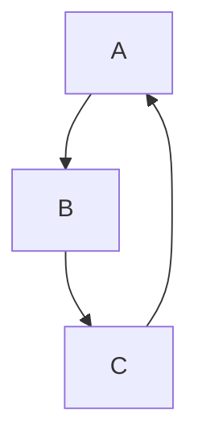

### Explaining Connected Component in Depth

Subgraphs where every pair is path-connected; finds clusters.

Why: Analyzes network partitions, like isolated user groups.

Code Sample:
```python
import networkx as nx
G = nx.Graph()
G.add_edges_from([('A', 'B'), ('C', 'D')])
print(list(nx.connected_components(G)))  # [{'A', 'B'}, {'C', 'D'}]
```

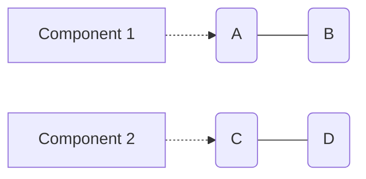

### Explaining Centrality in Depth

Measures node importance: Degree for locals, betweenness for controllers, PageRank for global.

Why: Prioritizes nodes in marketing or traffic.

Code Sample (PageRank):
```python
import networkx as nx
G = nx.DiGraph([('A', 'B'), ('A', 'C'), ('C', 'A')])
print(nx.pagerank(G))  # {'A': 0.37, 'B': 0.26, 'C': 0.37}
```

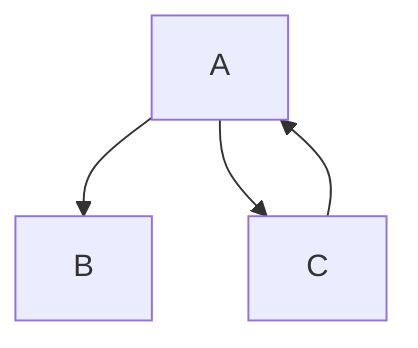

Apply: Dijkstra for weighted shortest paths; BFS for unweighted. Theory predicts: Triadic closures (A-B, A-C imply B-C); structural balance (stable friend/enemy triangles).

In Python (using networkx):

```python
import networkx as nx

G = nx.Graph()
G.add_edges_from([('A', 'B'), ('A', 'C'), ('B', 'D')])
print(nx.shortest_path(G, 'A', 'D'))  # Output: ['A', 'B', 'D']
print(nx.degree_centrality(G))  # {'A': 0.666, 'B': 0.333, ...}
```

Why theory? Guides modeling—use centrality for influencer targeting.

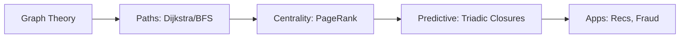

## Core Concepts: Nodes and Edges

At heart, graph DBs store nodes and relationships.

- **Nodes**: Represent entities (users, products). Each has:
  - Unique ID (auto-generated or custom).
  - Labels (categories, e.g., :Person, :Movie—multi-label possible).
  - Properties (key-values: name="Alice", rating=4.5).

- **Edges**: Connect nodes.
  - Direction: -> for outgoing, <- for incoming.
  - Labels: :KNOWS, :BOUGHT (defines type).
  - Properties: since=2020, strength=0.8.
  - Uniqueness: Often enforced to avoid duplicates.

### Explaining Nodes in Depth

Nodes are the building blocks, representing any entity. IDs ensure uniqueness; labels group them (e.g., query all :Person). Properties store data like attributes.

Why flexible: No schema means add properties anytime, ideal for evolving apps.

Code Sample (Cypher create node):
```cypher
CREATE (p:Person {name: 'Alice', age: 30})
RETURN p
```

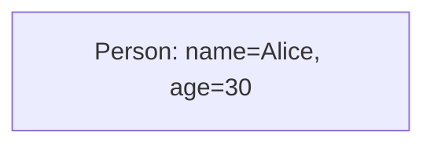

### Explaining Edges in Depth

Edges define how nodes relate, with direction for semantics (e.g., :FOLLOWS is directed). Labels type them; properties add details like timestamps.

Why powerful: Edges are first-class citizens, enabling fast traversals without joins.

Code Sample:
```cypher
MATCH (a:Person {name: 'Alice'}), (b:Person {name: 'Bob'})
CREATE (a)-["r:KNOWS {since: 2020}"]->(b)
RETURN r
```

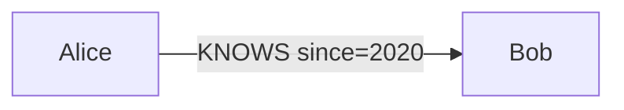

No fixed schema—add properties on the fly. But for efficiency, index frequent ones (e.g., CREATE INDEX ON :Person(name)).

How: In property graphs (dominant model), everything's key-value enriched. Traversal: Start at node, follow edges via pointers.

Example: Twitter graph.

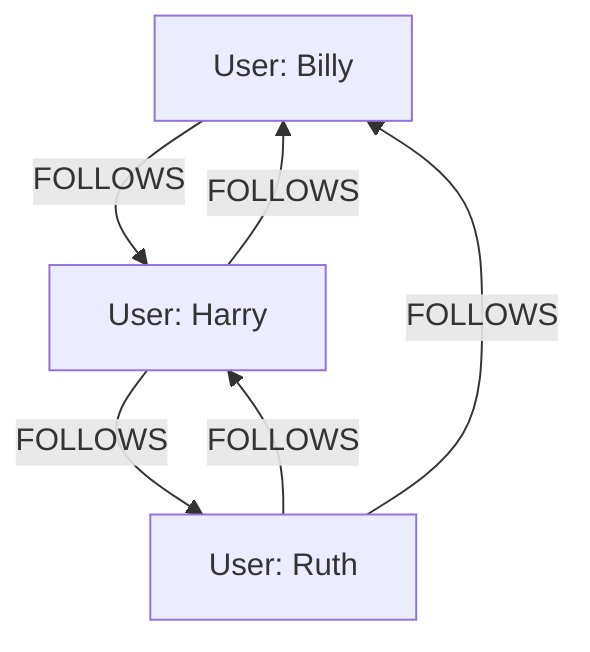

Why: Mimics real-world—flexible, efficient for connected queries.

## Graph Models Compared

Models shape how you store and query.

- **Labeled Property Graph (LPG)**: Flexible, app-centric. Nodes/edges with labels/properties. Ideal for social, e-commerce. Query patterns like paths.
  
- **Resource Description Framework (RDF)**: Semantic web standard. Data as triples (subject-predicate-object, e.g., Alice-knows-Bob). Great for ontologies, inference. Query with SPARQL.

- **Hypergraph**: Edges link >2 nodes (e.g., a meeting with multiple attendees). Niche but powerful for complex groups.

- **Others**: Key-value graphs (simple pairs), multi-model (graph + document).

### Explaining Labeled Property Graph (LPG) in Depth

LPG allows arbitrary labels and properties on nodes/edges, making it intuitive for app developers. It's "whiteboard-friendly"—draw your domain, implement directly.

Why popular: Supports rich, flexible modeling without rigid schemas, perfect for agile dev.

Code Sample (Cypher for LPG):
```cypher
CREATE (a:Person {name:'Alice'})-[":KNOWS {since:2020}"]->(b:Person {name:'Bob'})
```

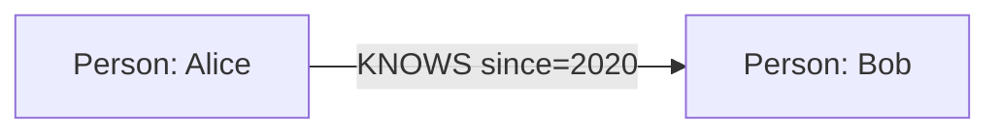

### Explaining Resource Description Framework (RDF) in Depth

RDF stores knowledge as triples, enabling semantic queries and inference (e.g., if A is type Human and Humans are Mortal, infer A is Mortal).

Why for semantics: Integrates with ontologies like OWL, great for linked data.

Code Sample (SPARQL):
```sparql
PREFIX foaf: <http://xmlns.com/foaf/0.1/>
SELECT ?name WHERE { ?person foaf:knows ?friend . ?person foaf:name ?name }
```

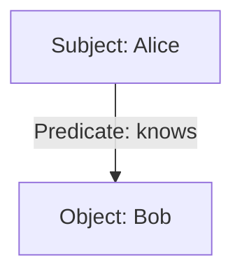

### Explaining Hypergraph in Depth

Hyperedges connect multiple nodes at once, modeling group relations like co-authors on a paper.

Why niche: Handles n-ary relations natively, but less common support.

Code Sample (Conceptual in Python):
```python
# Using hypernetx library (if available)
import hypernetx as hnx
hyperedges = {0: ['A', 'B', 'C']}  # One hyperedge connecting three nodes
H = hnx.Hypergraph(hyperedges)
```

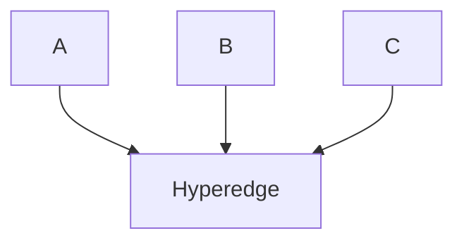

### Explaining Others in Depth

Includes simple key-value (edges as pairs) or multi-model (graph + JSON docs). 

Why versatile: Combines strengths, like OrientDB's graph-document hybrid.

Code Sample (OrientDB SQL-like):
```sql
CREATE VERTEX Person SET name = 'Alice'
CREATE EDGE Knows FROM (SELECT FROM Person WHERE name='Alice') TO (SELECT FROM Person WHERE name='Bob')
```

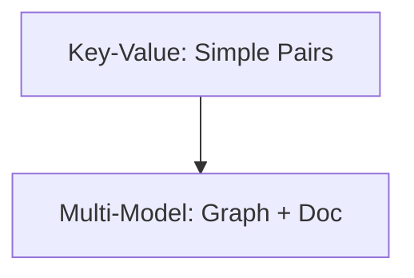

LPG dominates for devs—whiteboard-natural. RDF for linked data integration. Choose LPG for speed, RDF for standards.

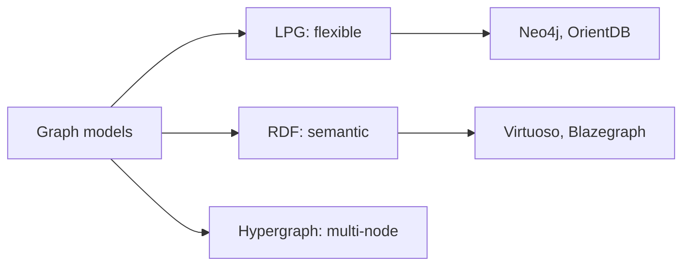

## Data Organization Techniques

Storage optimizes traversals.

- **Native Storage**: Direct pointers (e.g., node stores outgoing edge IDs). Fast for depth-first searches. Fixed-size records for quick access.

- **Indexing**: Hash or B-tree on properties/labels. Start queries fast, then traverse.

- **Partitioning**: Divide into records (nodes separate from edges). Some use adjacency lists.

- **Distribution**: Sharding (hash nodes across servers), replication for reads. Challenges: Cross-shard queries slow.

### Explaining Native Storage in Depth

Native stores use file-based records with pointers—nodes point to relationship chains. Neo4j example: 9-byte node records, 34-byte relationship records, double-linked for bidirectionality.

Why fast: Index-free adjacency; traversal time scales with %% size, not database.
```

### Explaining Indexing in Depth

Indexes speed initial lookups (e.g., find node by name), then traversal takes over. Types: Composite for multiple properties.

Why balance: Indexes boost reads but slow writes; use judiciously.

Code Sample (Cypher index):
```cypher
CREATE INDEX ON :Person(name, age)
MATCH (p:Person {name: 'Alice'}) RETURN p
```

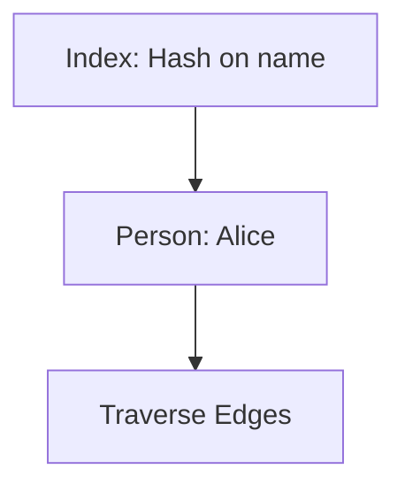

### Explaining Partitioning in Depth

Data split into files: node_store.db for nodes, relationship_store.db for edges. Adjacency lists group a node's edges.

Why efficient: Localized access reduces I/O for traversals.

Code Sample (Pseudo):
```python
# Simulate partitioning
nodes = {1: {'label': 'Person'}}
relationships = {1: {'from': 1, 'to': 2, 'type': 'KNOWS', 'next': 2}}
# Traverse from node 1
current = 1
while current:
    rel = relationships[current]
    print(rel['to'])
    current = rel.get('next')
```

```mermaid
flowchart TD
    Partition1["Node Records"] --> Partition2["Edge Records"]
    Partition2 --> Adjacency["Adjacency Lists"]
```

### Explaining Distribution in Depth

Sharding partitions data across servers; replication copies for fault-tolerance. Neo4j clusters use causal consistency.

Why scalable: Handles petabyte graphs, but cross-shard traversals need optimization.

Code Sample (Conceptual cluster query):
```cypher
// Assuming distributed setup
MATCH (a:Person {name: 'Alice'})-[":KNOWS"]->(b) RETURN b  // May hit multiple shards
```

```mermaid
flowchart TD
    Server1["Server1: Shard A"] --> Replica1[Replica]
    Server2["Server2: Shard B"] --> Replica2
Query[Query] --> Server1
Query[Query] --> Server2
```

For devs: Tune indexes—overdo it, and writes suffer. Use EXPLAIN in queries to spot bottlenecks.

Why native? Index-free adjacency—queries proportional to traversed graph, not total size.

Example: In Neo4j, a node's record points to first relationship; each relationship points to next, forming chains.

```mermaid
flowchart LR
    NodeRecord --> FirstRelationship
    FirstRelationship --> NextRel
    NextRel --> Node
    NodeRecord --> Labels
    Labels --> Properties
```

## Querying Graphs: Languages That Click

Queries pattern-match paths.

- **Cypher**: Declarative (Neo4j). Describe what, engine optimizes how.
  Example: Find friends-of-friends.
  ```
  MATCH (p:Person)-[":KNOWS"]->(friend)-[":KNOWS"]->(fof)
  WHERE p.name = 'Alice' AND NOT (p)-[":KNOWS"]->(fof)
  RETURN fof.name
  ```

- **Gremlin**: Imperative (TinkerPop). Step-by-step: g.V().has('name', 'Alice').out('KNOWS').out('KNOWS').

- **SPARQL**: For RDF. SELECT ?fof WHERE { ?p :name "Alice" . ?p :KNOWS ?friend . ?friend :KNOWS ?fof . FILTER(?p != ?fof) }

### Explaining Cypher in Depth

Cypher is human-readable, declarative—focus on patterns, not steps. Clauses: MATCH for patterns, CREATE for writes, RETURN for outputs.

Why accessible: Reads like English, auto-optimized for perf.

Code Sample (Variable-length path):
```cypher
MATCH (a:Person {name: 'Alice'})-[":KNOWS*1..3"]->(contact)
RETURN contact.name, length(path) AS degrees
```

```mermaid
flowchart LR
    Alice -->|KNOWS| Friend1
    Friend1 -->|KNOWS| FoF
    Alice -.->|*1..3| FoF
```

### Explaining Gremlin in Depth

Gremlin is traversal-based, imperative—chain steps like .out() for outgoing edges.

Why flexible: Fine control for complex logic, portable across DBs.

Code Sample (Groovy-style):
```groovy
g.V().has('name', 'Alice').repeat(out('KNOWS')).times(2).path()
```

```mermaid
flowchart TD
    Start["V: Alice"] -->|out(KNOWS)| Step1[Friend]
    Step1 -->|out(KNOWS)| Step2[FoF]
```

### Explaining SPARQL in Depth

SPARQL queries RDF triples with SELECT/WHERE, supporting inference.

Why for semantics: Handles namespaces, filters complex conditions.

Code Sample:
```sparql
PREFIX ex: <http://example.org/>
SELECT ?friend WHERE { ex:Alice ex:knows ?friend }
```

```mermaid
flowchart TD
    Alice -->|ex:knows| Friend
```

Declarative wins for readability—write once, run anywhere. Add WHERE for filters, ORDER BY for sorting, LIMIT for paging.

Advanced: Variable-length paths (e.g., (p)-[*2..4]->(target) for 2-4 hops), aggregations (COUNT, AVG).

## Data Modeling Basics

Model whiteboard-style: Sketch entities, draw arrows.

Steps:
1. Identify nodes: Core entities.
2. Define relationships: How they connect?
3. Add labels/properties: Enrich.
4. Iterate: Test with sample queries.

### Explaining Identify Nodes in Depth

Start with domain nouns as nodes (e.g., User, Product in e-commerce).

Why first: Nodes are foundations; misidentify, and model skews.

Code Sample:
```cypher
CREATE (u:User {id: 'u1'}), (p:Product {id: 'p1'})
```

```mermaid
flowchart TD
    U[User] 
    P[Product]
```

### Explaining Define Relationships in Depth

Verbs become edges (e.g., :PURCHASED).

Why crucial: Relationships drive value; wrong types hinder queries.

Code Sample:
```cypher
MATCH (u:User {id: 'u1'}), (p:Product {id: 'p1'})
CREATE (u)-[":PURCHASED {date: '2025-11-06'}"]->(p)
```

```mermaid
flowchart LR
    U[User] -->|PURCHASED date=2025| P[Product]
```

### Explaining Add Labels/Properties in Depth

Labels categorize; properties add data.

Why enrich: Enables filtered queries, richer analysis.

Code Sample:
```cypher
MATCH (u:User {id: 'u1'})
SET u:PremiumUser, u.membership = 'Gold'
```

```mermaid
flowchart LR
    Labels[":PremiumUser"] --> User["User id=u1"]
    Props["membership = Gold"] --> User
```

### Explaining Iterate in Depth

Run queries, refine model based on perf/needs.

Why agile: Models evolve with business.

Code Sample (Test query):
```cypher
MATCH (u:User)-[":PURCHASED"]->(p:Product)
RETURN count(p) AS purchases
```

```mermaid
flowchart LR
    Model["Initial model"] --> Test["Run queries"]
    Test --> Refine["Refine model"]
    Refine --> Model
```

Example: Movie domain.
- Nodes: :Actor {name}, :Movie {title, year}.
- Edges: (actor)-[":ACTED_IN {role}"]->(movie).

Avoid relational pitfalls: No join tables—use edges. Model events as nodes if they have properties (e.g., :Purchase node with date, amount).

For time-series: Use chains like (event1)-[":NEXT"]->(event2).

Validate: Run queries early to ensure traversability.

```mermaid
flowchart TD
    App["App asset"] --> DB[Database]
    App --> VM[VM]
    VM --> Server[Server]
    Server --> Rack[Rack]
    User[User] --> App
```

Why? Directly translates domain, flexible for changes.

## Data Modeling Pitfalls to Avoid

Common traps:
- Over-generic relationships—use specific (:EMAILED vs. :SENT_TO on email node).
- Ignore events as nodes—model emails as nodes for replies/forwards.
- Directionless edges—always specify for semantics.

### Explaining Over-Generic Relationships in Depth

Using vague edges like :RELATED loses semantics; specific labels enable precise queries.

Why avoid: Hard to filter, slows analysis.

Code Sample (Bad to good):
```cypher
// Bad
CREATE (a)-[":RELATED"]->(b)
// Good
CREATE (a)-[":EMAILED {date: '2025'}"]->(b)
```

```mermaid
flowchart LR
    A -->|RELATED (vague)| B
```

### Explaining Ignore Events as Nodes in Depth

Events like purchases have properties—model as nodes for relations like refunds.

Why: Captures complexity, enables paths like purchase chains.

Code Sample:
```cypher
CREATE (p:Purchase {id:1, amount:100})
CREATE (u:User)-[":MADE"]->(p)-[":FOR"]->(prod:Product)
```

```mermaid
flowchart LR
    User[User] -->|MADE| Purchase[Purchase]
    Purchase -->|FOR| Product[Product]
```

### Explaining Directionless Edges in Depth

Undirected edges miss intent (e.g., who follows whom).

Why specify: Enables accurate traversals, like incoming vs. outgoing.

Code Sample:
```cypher
CREATE (a)-[":FOLLOWS"]->(b)  // Directed
```

```mermaid
flowchart LR
    A -->|FOLLOWS (directed)| B
```

How: For email fraud, start with users linked by :EMAILED. Pitfall: Misses details. Fix: Add :Email nodes with :SENT, :TO, :CC, :BCC, :REPLY_TO.

Example evolution:

```cypher
CREATE (bob:User {name:'Bob'})-[":ALIAS_OF"]->(alice:User {name:'Alice'})
CREATE (email:Email {id:1, content:'Hi Charlie...'})
CREATE (bob)-[":SENT"]->(email)-[":TO"]->(charlie:User {name:'Charlie'})
CREATE (email)-[":CC"]->(davina:User {name:'Davina'})
CREATE (reply:Reply {id:2})-[":REPLY_TO"]->(email)
MATCH (e:Email)-[":REPLY_TO*"]->(orig:Email) RETURN orig.id
```

Why? Captures complexity without shortcuts, enables deep analysis.

## Why Ditch Relational for Graphs?

RDBMS: ACID-strong, but joins kill performance on connected data. Query cost grows with depth—O(n^d) worst-case.

Graphs: Index-free adjacency—follow pointers, O(1) per edge. Scales to billions of nodes.

When to switch:
- High relationship density.
- Frequent path queries.
- Evolving schema.

### Explaining High Relationship Density in Depth

In dense graphs (e.g., social with avg 150 connections), RDBMS joins explode tables.

Why switch: Graphs handle without perf loss.

Code Sample (RDBMS sim vs graph):
```sql
-- RDBMS slow join
SELECT * FROM users u JOIN friends f ON u.id = f.user_id JOIN users friend ON f.friend_id = friend.id
```

```cypher
-- Graph fast
MATCH (u:User)-[":FRIENDS"]->(friend) RETURN friend
```

```mermaid
flowchart TD
    RDBMS["Tables + Joins"] -->|Slow| Dense["Dense Graph"]
    Graph[Pointers] -->|Fast| Dense
```

### Explaining Frequent Path Queries in Depth

Paths like "route from A to Z" are common; RDBMS recursive queries lag.

Why graphs: Built-in algos like shortestPath.

Code Sample:
```cypher
MATCH p=shortestPath((a)-[*]-(z)) RETURN p
```

```mermaid
flowchart LR
    A[A] --> Mid((...)) --> Z[Z]
    Note["Path query from A to Z"] -.-> Mid
```

### Explaining Evolving Schema in Depth

Add columns in RDBMS requires ALTER; graphs add properties ad hoc.

Why agile: No downtime for changes.

Code Sample:
```cypher
MATCH (n) SET n.newProp = 'value'
```

```mermaid
flowchart LR
    Old["Old schema"] -->|add property| New["New schema"]
```

Hybrid: Use graphs for connections, RDBMS for transactions.

How: Migrate—import CSV to nodes/edges.

```python
# Python with neo4j driver
from neo4j import GraphDatabase
driver = GraphDatabase.driver("bolt://localhost")
with driver.session() as session:
    session.run("LOAD CSV FROM 'file:///users.csv' AS row CREATE (:User {name: row.name})")
```

Why? Scales with relationships, agile dev.

## NoSQL Context: Where Graphs Fit

NoSQL handles variety/scale. Types:
- Key-Value: Fast lookups (Redis).
- Document: Nested structures (MongoDB).
- Column: Analytics (Cassandra).
- Graph: Relationships (Neo4j).

### Explaining Key-Value in Depth

Simple stores like key to value, great for caches.

Why fit: Graphs can layer on them but add relations.

Code Sample (Redis sim):
```python
import redis
r = redis.Redis()
r.set('user:1', 'Alice')
print(r.get('user:1'))
```

```mermaid
flowchart TD
    Key["user:1"] --> Value[Alice]
```

### Explaining Document in Depth

JSON-like with nesting, for semi-structured data.

Why: Graphs extend with links between docs.

Code Sample (Mongo sim):
```python
from pymongo import MongoClient
client = MongoClient()
db = client.test
db.users.insert_one({'name': 'Alice', 'friends': ['Bob']})
```

```mermaid
flowchart TD
    Doc["Document: Alice & Bob"]
```

### Explaining Column in Depth

Wide rows for time-series, analytics.

Why: Graphs for connected analytics.

Code Sample (Cassandra sim):
```python
# Conceptual
row = {'user_id': 1, 'col1': 'value1', 'col2': 'value2'}
```

```mermaid
flowchart TD
    Row["User record"] --> Col1["Column 1"]
    Row --> Col2["Column 2"]
```

### Explaining Graph in Depth

Focus on relations, as detailed earlier.

Why standout: Native for connected data.

Graphs are NoSQL with ACID options. vs BASE: ACID for consistency (e.g., bank transfers); BASE for availability (eventual consistency).

Why graphs? Handle connected variety better than aggregates.

Tour: Aggregates group data (e.g., order with items); graphs link freely.

## Native vs Non-Native Processing

- **Native**: Engine built for graphs (pointer-based storage). Traversals fly.
- **Non-Native**: Graph layer on other stores. Simulate edges—slow for depth.

### Explaining Native in Depth

Purpose-built, with direct pointers for hops.

Why superior: Real-time on large graphs.

Code Sample (Neo4j native traversal):
```cypher
MATCH (a)-[*]->(b) RETURN path
```

```mermaid
flowchart LR
    NodeA["Node A"] -->|pointer| NodeB["Node B"] -->|pointer| NodeC["Node C"]
```

### Explaining Non-Native in Depth

Overlays like SQL graphs; use indexes for simulation.

Why limited: Depth causes join explosions.

Code Sample (SQL graph sim):
```sql
SELECT * FROM nodes n JOIN edges e ON n.id = e.from_id
```

```mermaid
flowchart LR
    Layer["Graph layer"] --> Base["RDBMS or KV store"]
```

Go native for production—non-native hits walls at scale.

```mermaid
flowchart TD
    A[Native] --> B["Pointers: Fast Hops"]
    A --> C["Optimized Traversals"]
    D["Non-Native"] --> E["Indexes: Extra Layer"]
    D --> F["Slow at Depth"]
```

## Graph Algorithms Essentials

Beyond storage: Analyze.

- **Pathfinding**: ShortestPath (A* for heuristics).
- **Centrality**: PageRank for ranking.
- **Community**: Louvain for clusters.
- **Similarity**: Jaccard for node overlap.

### Explaining Pathfinding in Depth

Finds optimal routes, like Dijkstra for weighted.

Why: Logistics, social connections.

Code Sample:
```cypher
CALL algo.shortestPath('Alice', 'Bob', 'KNOWS', 'Person')
```

```mermaid
flowchart LR
    Alice -->|cost=1| Friend -->|cost=2| Bob
```

### Explaining Centrality in Depth

Ranks nodes by importance.

Why: Identify key players.

Code Sample:
```cypher
CALL algo.pageRank()
```

```mermaid
flowchart TD
    A["High Rank"] --> B
    A --> C
```

### Explaining Community in Depth

Groups densely connected nodes.

Why: Market segments.

Code Sample:
```cypher
CALL algo.louvain()
```

```mermaid
flowchart TD
    A --> B
    C --> D
```

### Explaining Similarity in Depth

Measures overlap, for recs.

Why: Find similar users.

Code Sample:
```cypher
CALL algo.nodeSimilarity()
```

```mermaid
flowchart TD
U1 --> P1
U1 --> P2
U2 --> P1
U2 --> P3
```

Use for insights: Recommend via common neighbors.

Example: Dijkstra in Australia graph (cities, flight hours).

```cypher
MATCH p=shortestPath((syd:City {name:'Sydney'})-[*]-(per:City {name:'Perth'}))
RETURN reduce(total=0, r in relationships(p) | total + r.hours) AS hours
```

Why: Predictive—triadic closures forecast links.

## Use Cases: Graphs in Action

- **Social**: Influence mapping.
- **Fraud**: Cycle detection.
- **Recs**: "People who bought this..."
- **Networks**: Routes, failures.
- **Bio**: Protein interactions.

### Explaining Social in Depth

Map influences via centrality.

Why: Targeted marketing.

Code Sample:
```cypher
MATCH (u:User)-[":FOLLOWS"]->(influencer)
RETURN influencer, count(u) ORDER BY count(u) DESC
```

```mermaid
flowchart LR
    U1["User 1"] --> I[Influencer]
    U2["User 2"] --> I
    U3["User 3"] --> I
    Note["Social mapping"] -.-> I
```

### Explaining Fraud in Depth

Detect cycles for rings.

Why: Prevent losses.

Code Sample:
```cypher
MATCH p=(a)-[*3..]-(a) RETURN p
```

```mermaid
flowchart LR
    A["Account A"] --> B["Account B"]
    B --> C["Account C"]
    C --> A
    Note["Cycle exposes suspicious fund transfers"] -.-> B
```

### Explaining Recs in Depth

Collaborative filtering via paths.

Why: Boost sales.

Code Sample:
```cypher
MATCH (u:User)-[":BOUGHT"]->(p)<-[":BOUGHT"]-(other)-[":BOUGHT"]->(rec)
RETURN rec
```

```mermaid
flowchart LR
    U[User] --> Purchased["Purchased product"]
    Other["Similar user"] --> Purchased
    Other --> Recommendation["Recommended product"]
    U -.-> Recommendation
```

### Explaining Networks in Depth

Route optimization.

Why: Efficiency.

Code Sample:
```cypher
MATCH p=shortestPath((start)-[*]-(end)) RETURN p
```

```mermaid
flowchart LR
    Start["Start node"] --> Hub1["Hub 1"]
    Hub1 --> Hub2["Hub 2"]
    Hub2 --> End[Destination]
    Start -.-> End
```

### Explaining Bio in Depth

Interaction paths.

Why: Drug discovery.

Code Sample:
```cypher
MATCH (prot1:Protein)-[":INTERACTS*"]-(prot2) RETURN path
```

```mermaid
flowchart LR
    Protein1["Protein 1"] --> Interaction[Interaction]
    Interaction --> Protein2["Protein 2"]
    Interaction --> Protein3["Protein 3"]
```

Real wins: Banks save millions spotting fraud graphs.

```mermaid
flowchart TD
    A["Use Cases"] --> B["Social Recs"]
    A --> C["Fraud Rings"]
    A --> D[Routing]
    B --> E["Paths: Common Connections"]
    C --> F["Cycles: Detect Loops"]
```

## Popular Graph Databases

51 from taxonomy, but highlights:

- **Neo4j**: Native LPG, Cypher, enterprise-ready.
- **OrientDB**: Multi-model (graph + document).
- **Virtuoso**: RDF focus.
- **JanusGraph**: Distributed, on Cassandra.

### Explaining Neo4j in Depth

Leading native LPG with Cypher, ACID, clustering for scale.

Why top: Mature ecosystem, high perf.

Code Sample:
```cypher
MATCH (n) RETURN n
```

### Explaining OrientDB in Depth

Combines graph, document, key-value.

Why versatile: Multi-paradigm apps.

Code Sample (Orient SQL):
```sql
SELECT FROM V
```

### Explaining Virtuoso in Depth

RDF/triple store with SPARQL.

Why semantic: Linked data.

Code Sample (SPARQL):
```sparql
SELECT * WHERE { ?s ?p ?o }
```

### Explaining JanusGraph in Depth

Scalable on backends like Cassandra.

Why big data: Distributed processing.

Code Sample (Gremlin):
```groovy
g.V()
```


```mermaid
flowchart LR
    Neo4j["Neo4j"] --> Neo4jCypher["Cypher"]
    Neo4j --> Neo4jCluster["Clustering"]
    OrientDB["OrientDB"] --> OrientGraph["Graph"]
    OrientDB --> OrientDocument["Document"]
    Virtuoso["Virtuoso"] --> VirtuosoModel["RDF"]
    Virtuoso --> VirtuosoQuery["SPARQL"]
    JanusGraph["JanusGraph"] --> JanusStorage["Cassandra"]
    JanusGraph --> JanusQuery["Gremlin"]
```
Compare:

| DB          | Model | Native? | Query Lang | Strengths          |
|-------------|-------|---------|------------|--------------------|
| Neo4j      | LPG   | Yes     | Cypher     | Speed, flexibility |
| OrientDB   | Multi | Yes     | SQL-like   | Versatile          |
| Virtuoso   | RDF   | No      | SPARQL     | Semantic web       |
| JanusGraph | LPG   | Yes     | Gremlin    | Distributed        |

## Distribution and Transactions

Scale out: Sharding (partition data), replication.

ETH: Support ACID? Sharding? Many do partial.

Neo4j: Causal clustering for reads/writes.

O'Reilly: Transactions ensure consistency.

Student: Balance with query needs.

Challenge: Global queries on distributed graphs.

- **Sharding**: Partition by hash or custom.
- **Replication**: Copies for failover/reads.
- **Transactions**: ACID ensures atomic commits.

### Explaining Sharding in Depth

Divides data across nodes, e.g., hash node IDs.

Why: Horizontal scale.

Code Sample (Conceptual):
```cypher
// Query may route to shard
MATCH (n) WHERE id(n) % 3 = 0 RETURN n  // Sim hash
```

```mermaid
flowchart LR
    Data["Data set"] --> Shard1["Shard 1"]
    Data --> Shard2["Shard 2"]
    Data --> Shard3["Shard 3"]
```
### Explaining Replication in Depth

Copies data for reads, failover.

Why: High availability.

Code Sample:
```cypher
// Read from replica
MATCH (n) RETURN n
```

```mermaid
flowchart LR
    Master["Master"] --> Replica1["Replica 1"]
    Master --> Replica2["Replica 2"]
    Master --> ReplicaRead["Read replica"]
```
### Explaining Transactions in Depth

ACID: Atomic, Consistent, Isolated, Durable.

Why: Reliable ops.

Code Sample:
```python
with session.begin_transaction() as tx:
    tx.run("CREATE (n)")
    tx.success = True
```

## Future Challenges

ETH outlines:

- Better distribution for massive graphs.
- Hybrid with other NoSQL.
- Streaming graphs (real-time changes).
- AI integration.

### Explaining Better Distribution in Depth

For trillion edges, advanced sharding needed.

Why: Handle web-scale.

Code Sample (Future conceptual):
```cypher
MATCH (n) DISTRIBUTED RETURN n
```

### Explaining Hybrid with Other NoSQL in Depth

Combine graph with document/column.

Why: Best of breeds.

Code Sample:
```cypher
MATCH (n) CALL document.lookup(n.id) RETURN n
```

### Explaining Streaming Graphs in Depth

Real-time updates, like Kafka integration.

Why: Dynamic data.

Code Sample:
```cypher
SUBSCRIBE TO changes CREATE (n)
```

```mermaid
flowchart LR
    Massive["Trillion edges"] --> Advanced["Advanced sharding"]
    HybridGraph["Graph engine"] --> HybridDoc["Document store"]
    HybridGraph --> HybridColumn["Column store"]
    StreamIn["Real-time stream"] --> GraphUpdate["Graph updates applied"]
    GraphUpdate --> Consumers["Apps use updates"]
    DataCore["Graph data"] --> GNN["Graph neural nets"]
    GNN --> Insights["Predictions"]
```
### Explaining AI Integration in Depth

Graph neural nets for predictions.

Why: Enhanced analytics.

Code Sample (PyTorch sim):
```python
import torch
# Graph NN model
```

Neo4j: Evolving queries.

O'Reilly: More algorithms.

Student: Scalability tweaks.

Graphs are rising; tackle these for dominance.

## Imperative vs Declarative Queries

Imperative: Step-by-step (Gremlin).

Declarative: What you want (Cypher).

Neo4j: Declarative faster to write, optimize.

ETH: Both in use.

O'Reilly: Declarative aligns with agile.

Choose declarative for accessibility.

- **Imperative**: Control flow (Gremlin loops).
- **Declarative**: Pattern-match (Cypher auto-optimizes).

### Explaining Imperative in Depth

Explicit steps, good for custom.

Why: Precise control.

Code Sample:
```groovy
g.V().has('name', 'Alice').out().out()
```

```mermaid
flowchart TD
    Step1 --> Step2 --> Step3
```

### Explaining Declarative in Depth

Describe result, optimizer handles.

Why: Simpler, efficient.

Code Sample:
```cypher
MATCH (a)-[]->(b)-[]->(c) RETURN c
```

```mermaid
flowchart TD
    Pattern["(a)->(b)->(c)"]
```

## Pitfalls in Graph Modeling

- Dense nodes: Fan-out kills perf—split or index.
- Wrong direction: Always specify -> or <-.
- Over-properties: Keep lean; use nodes for complex.
- No versioning: Model history with timed edges.

### Explaining Dense Nodes in Depth

Nodes with thousands of edges slow traversals; split into sub-nodes.

Why avoid: Memory/per f issues.

Code Sample:
```cypher
// Split dense
CREATE (hub:Hub) -[":PART_OF"]-> (sub:SubNode)
```

```mermaid
flowchart TD
Dense --> Sub1
Dense --> Sub2
```

### Explaining Wrong Direction in Depth

Missing direction confuses semantics.

Why: Wrong query results.

Code Sample:
```cypher
(a)-[":KNOWS"]->(b)  // Correct
```

```mermaid
flowchart LR
    A --> B
```

### Explaining Over-Properties in Depth

Too many props per node bloats; use related nodes.

Why: Better organization.

Code Sample:
```cypher
CREATE (p:Person)-[":HAS_ADDRESS"]->(addr:Address {street: '123 Main'})
```

```mermaid
flowchart TD
    P[Person] --> Addr[Address]
```

### Explaining No Versioning in Depth

For history, use timed edges or version nodes.

Why: Track changes.

Code Sample:
```cypher
CREATE (v1:Version {state: 'old'})-[":NEXT {time: '2025'}"]->(v2:Version {state: 'new'})
```

```mermaid
flowchart TD
    V1 -->|NEXT time=2025| V2
```

Test with load—simulate growth.

Why: Prevents perf hits.

## Getting Started with Neo4j

Download, run.

Create: `CREATE (a:Person {name:'Alice'})-[":KNOWS"]->(b:Person {name:'Bob'})`

Query: `MATCH (a:Person)-[":KNOWS"]->(b) RETURN a, b`

Neo4j: Community free; enterprise scales.

Install: Download, bin/neo4j console.

Python driver: pip install neo4j.

Code:
```python
from neo4j import GraphDatabase

driver = GraphDatabase.driver("bolt://localhost:7687", auth=("neo4j", "password"))

def add_friend(tx, name, friend_name):
    tx.run("MERGE (a:Person {name: $name}) "
           "MERGE (b:Person {name: $friend_name}) "
           "MERGE (a)-[":KNOWS"]->(b)", name=name, friend_name=friend_name)

with driver.session() as session:
    session.execute_write(add_friend, "Alice", "Bob")
```

Query:
```
MATCH (a:Person)-[":KNOWS"]->(b) RETURN a.name, b.name
```

Scale: Use clusters for prod.

## Wrapping Up

Graphs transform data from static to dynamic. Build one—start small, query big.

## Acknowledgements

This manual draws from:
- *Demystifying Graph Databases: Analysis and Taxonomy of Data Organization, System Designs, and Graph Queries* by Maciej Besta, Robert Gerstenberger, Emanuel Peter, Marc Fischer, Michał Podstawski, Claude Barthels, Gustavo Alonso, and Torsten Hoefler (ACM Computing Surveys, 2023).
- *Graph Databases for Beginners* by Bryce Merkl Sasaki, Joy Chao, and Rachel Howard (Neo4j, Inc.).
- *Graph Databases* by Prad Nelluru, Bharat Naik, Evan Liu, and Bon Koo.
- *Graph Databases: New Opportunities for Connected Data* (2nd Edition) by Ian Robinson, Jim Webber, and Emil Eifrem (O'Reilly Media, 2015).